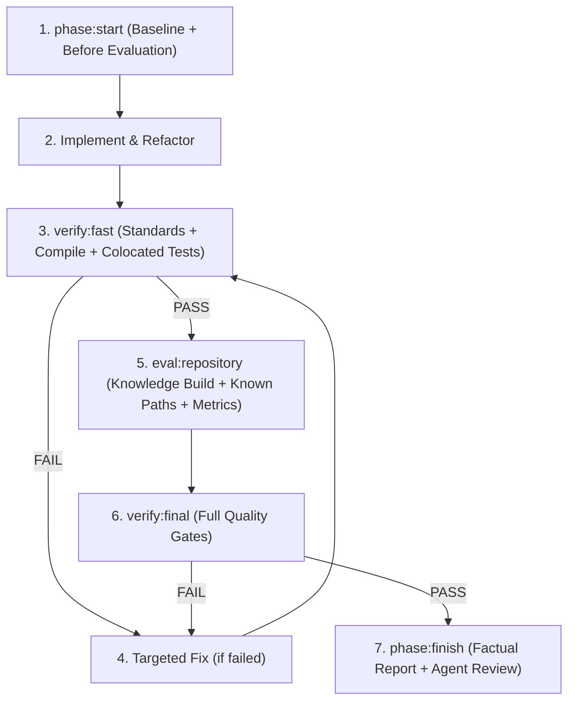

# 🤖 Mechanized Development Workflow (Canonical Policy)

本書は CodePrep プロジェクトにおける、すべての AI エージェント（Claude Code, Gemini / Antigravity, Codex, OpenCode 等）および人間の開発者が遵守すべき共通の開発実行ポリシーである。

---

## 1. 基本原則 (Mechanization Principle)

> **If a task step is deterministic, repeatable, and already understood, move it from the agent workflow into a script / tool / quality gate.**
> （手順が分かった決定論的作業をAIエージェントに手作業で繰り返させない。AIエージェントは未形式化部分、設計判断、コード実装、Failure解析に集中させる。）

- **Machine（Harness）の責務**:
  - 再現可能な手順の実行
  - 変更ファイルと影響テストの自動検出
  - 検査（Lint / TypeCheck / Standards）
  - 計測・集計（性能、ノード・エッジ数、ファイルサイズ）
  - 事実セクションの記録
- **AI Agent（人間 / LLM）の責務**:
  - 設計判断
  - 実装
  - 障害・エラー原因の分析
  - レビュー判定（`BLOCKER` / `SHOULD FIX` / `DEFER`）
  - 次工程・方針の判断

---

## 2. 標準実行順序 (Execution Order)

各 Phase やタスクは、以下の決定論的パイプラインに従って進める。

---

## 3. レビューゲート規約 (Review Gate)

AI エージェントが判断・分類する内容は、必ず以下の3段階で評価する:

1. **`BLOCKER` (進行阻止)**:
   - 型エラー、不変条件違反、テスト失敗、仕様欠落、規約違反。
   - **次工程への進行条件**: `BLOCKER = 0` であること。
2. **`SHOULD FIX` (推奨改善)**:
   - 後続フェーズに悪影響を及ぼす可能性があるが、現スコープの契約は満たしている軽微な負債や重複。
3. **`DEFER` (意図的見送り)**:
   - スコープ外の機能追加、将来フェーズ（Phase 7F 等）で扱うべき最適化、非ゴール事項。

---

## 4. 自動コミットの厳禁 (No Automatic Commit)

- **Harness は絶対に `git commit` を実行しない**。
- **AI エージェントも、ユーザーから明示的な指示がない限り勝手に `git commit` してはならない**。
- 常に変更一覧と検証結果を報告し、ユーザーの確認を経てからコミットを行う。

---

## 5. 入出力規約 (Machine Output Contract)

- `--format json` 指定時: **標準出力（stdout）には純粋な JSON のみを1行出力する**。ログや診断メッセージを stdout に混入させてはならない。
- ログ・警告・プログレスメッセージは必ず **標準エラー出力（stderr）** に出力する。
- 自動化できない判断事項は、Harness が捏造せず `unresolved` または `manualReviewRequired` として出力する。

---

## 6. 失敗時のルール (Failure Rule)

- 品質ゲートや検証が失敗した場合、**エラーを黙殺（bypass）してはならない**。
- Harness は必ず非ゼロの終了コード（Exit Code 1 等）で終了し、失敗したコマンド・原因・未解決対象を明示する。
