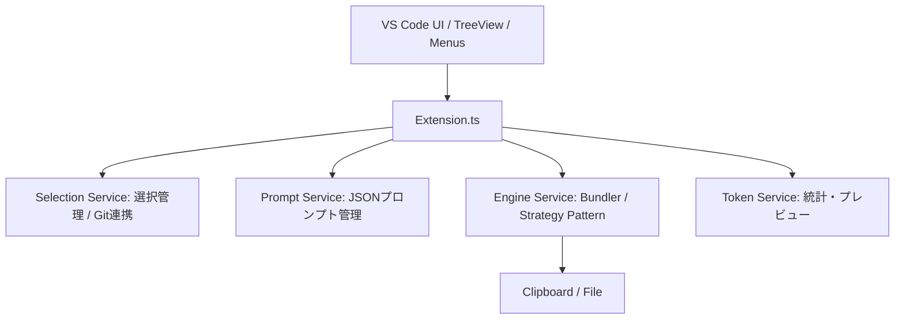

# CodePrep V2 - テクニカル・デザイン・ドキュメント

## 1. システム・アーキテクチャ (High-Level)

システムは5つの主要なサービスと、VS Code UIを制御するコントローラーで構成する。



## 2. モジュール設計（エージェントへの指示書）

### 2.1. Selection Service (Git Diff / Presets)
*   **責任**: どのファイルが選択されているかを管理する。
*   **新機能**:
    *   `selectByGitDiff()`: `git status --porcelain` を内部で実行（またはVS Code Git APIを使用）し、変更があるファイルのみを `SelectionService` に追加する。
    *   `savePreset(name: string)` / `loadPreset(name: string)`: `workspaceState` に名前付きでパス配列を保存する。

### 2.2. Prompt Service (Prompt Injection)
*   **責任**: プロンプトのテンプレート管理と合成。
*   **データ構造**: `prompts.json`
    ```json
    {
      "code-review": "You are an expert reviewer. Please find bugs in the following code...",
      "refactor": "Refactor this code for better performance...",
      "document": "Generate README and JSDoc for this..."
    }
    ```
*   **動作**: `EngineService` が最終出力を生成する直前に、選択されたプロンプトを先頭に挿入する。

### 2.3. Engine Service (Multi-Format / No-Dependency)
*   **責任**: 権利関係に配慮した「クリーン再実装」によるパック。
*   **エンジンタイプ**:
    1.  `NativeEngine`: 自前でMarkdown/XML/JSONを構築（前述の実装）。
    2.  `CodePrepCLIEngine`: 既存のCLIを呼び出す互換モード。

### 2.4. Token Service (Analytics)
*   **責任**: LLMへの負荷を可視化。
*   **ロジック**: 
    *   簡略化のため `(文字数 / 4)` または `(バイト数 / 4)` で推定トークンを算出。
    *   `StatusBarItem` を使用し、右下に「Estimated Tokens: 4.2k」と常時表示。

---

## 3. 具体的な拡張機能の定義（package.json Contribution）

AIエージェントに以下の `contributes` を実装させる。

```json
{
  "contributes": {
    "menus": {
      "explorer/context": [
        {
          "command": "codeprep.addToSelection",
          "group": "7_modification",
          "when": "resourceScheme == file"
        }
      ],
      "view/title": [
        {
          "command": "codeprep.selectGitDiff",
          "when": "view == codeprep.fileTree",
          "group": "navigation@5"
        },
        {
          "command": "codeprep.selectPrompt",
          "when": "view == codeprep.fileTree",
          "group": "navigation@6"
        }
      ]
    },
    "configuration": {
      "properties": {
        "codeprep.customPrompts": {
          "type": "object",
          "default": {},
          "description": "Define your custom prompts here (Key-Value pairs)."
        },
        "codeprep.outputFormat": {
          "type": "string",
          "enum": ["markdown", "json", "xml"],
          "default": "markdown"
        }
      }
    }
  }
}
```

---

## 4. 自律実行のための実装ステップ (Roadmap)

エージェントには以下の順番でタスクを消化させる。

### Step 1: プロンプト合成機能の追加
`src/services/PromptService.ts` を作成。
*   `vscode.window.showQuickPick` を使って、設定から読み込んだプロンプトを選択させる。
*   選択されたプロンプトを `SelectionService` の状態の一部として一時保存する。

### Step 2: Git Diff 連携の実装
`src/utils/git.ts` を作成。
*   `child_process.execSync('git diff --name-only')` を実行し、カレントディレクトリからの相対パスリストを取得。
*   そのリストを `SelectionService.setSelection()` に流し込む。

### Step 3: トークンカウンターの統合
`src/services/TokenService.ts` を作成。
*   `SelectionService` の状態が変わるたびに（Eventリスナー）、全選択ファイルの合計サイズを再計算。
*   `vscode.window.createStatusBarItem` で結果を表示。

### Step 4: コンテキストメニューの実装
*   `explorer/context` メニューからファイルやディレクトリのURIを取得。
*   ディレクトリの場合はその配下のファイルを再帰的に `SelectionService` に追加。

---

## 5. 権利関係と安全性についてのガードレール

AIエージェントへの制約事項：
1.  **ライセンス遵守**: 外部のバイナリやライブラリをラップせず、文字列操作（Template Literal）のみでXML/Markdownを構築すること。
2.  **プライバシー**: プロンプトやコードを外部サーバーに送信しない。すべてローカルのクリップボードまたはファイル出力で完結させること。
3.  **パフォーマンス**: 巨大なリポジトリ（node_modulesなど）をスキャンする際は、必ず設定の `exclude` パターンを先に適用し、メインスレッドをブロックしないこと。

---

# CodePrep V2 開発実行計画書

## 0. 基本方針
*   **モジュール化**: 各機能をサービスとして独立させ、`extension.ts`（コントローラー）で統合する。
*   **疎結合**: 特定のCLIに依存せず、設定一つでエンジン（Native/CLI）を切り替え可能にする。
*   **検証駆動**: 各フェーズの終わりに、具体的な検証項目を設ける。

---

## 1. スプリント別タスク一覧

### フェーズ 1: アーキテクチャの抽象化とプロンプト管理
> **目的**: 複数の出力形式とカスタムプロンプトを扱える基盤を作る。

*   [ ] **1.1. IEngine インターフェースの定義**: `src/engines/IEngine.ts` の作成。
*   [ ] **1.2. NativeEngine の実装**: 外部ライブラリを使わず、Markdown/JSON/XMLを生成するロジックを実装。
*   [ ] **1.3. PromptService の実装**: `package.json` の設定（`codeprep.customPrompts`）からプロンプトを読み込み、コードの先頭に付与するロジックを実装。
*   [ ] **1.4. Configuration の定義**: `package.json` に `outputFormat`, `useNativeEngine`, `customPrompts` の設定項目を追加。

**【検証項目】**: 設定で「XML」を選び、カスタムプロンプトを選択して実行した際、クリップボードに正しく合成されたXMLが出力されること。

---

### フェーズ 2: AI最適化（トークン計算）と統計情報
> **目的**: ユーザーがLLMに投げる前に「サイズオーバー」に気づけるようにする。

*   [ ] **2.1. TokenService の実装**: 選択されたファイルの合計文字数・バイト数から推定トークンを計算する。
*   [ ] **2.2. StatusBar 統合**: VS Codeのステータスバー（右下）に「~4.5k tokens / 12 files」のようにリアルタイム表示。
*   [ ] **2.3. イベント連携**: ツリーのチェックボックスが変わるたびに TokenService を更新するリスナーを実装。

**【検証項目】**: ファイルを選択/解除するたびに、ステータスバーの数字が即座に更新されること。

---

### フェーズ 3: ワークフロー強化（Git連携 & プリセット）
> **目的**: 「何を選択するか」の作業を自動化・効率化する。

*   [ ] **3.1. GitDiff モードの実装**: `git diff --name-only` を実行し、変更があるファイルのみを自動選択するコマンドの実装。
*   [ ] **3.2. プリセット保存機能**: 現在の選択状態を名前を付けて `workspaceState` に保存・復元できるようにする。
*   [ ] **3.3. コンテキストメニュー統合**: 標準エクスプローラーを右クリックして「Add to CodePrep」ができるように `package.json` の `menus` を拡張。

**【検証項目】**: Gitでファイルを修正後、「Select Modified Files」ボタン一発でそれらがツリー上でチェックされること。

---

### フェーズ 4: プロパティ設定画面 & UIリファイン
> **目的**: 複雑になった設定をユーザーが直感的に扱えるようにする。

*   [ ] **4.1. 設定画面（Settings UI）の整備**: VS Code標準の設定画面で、JSONプロンプトをエディタ感覚で編集できるように `items` スキーマを定義。
*   [ ] **4.2. コマンドパレットの整理**: `codeprep.savePreset`, `codeprep.loadPreset` などのコマンドを整理。

**【検証項目】**: 設定画面から新しいプロンプトを追加し、それが即座に実行時の選択肢に現れること。

---

## 2. 実装のガードレール（エージェントへの制約）

エージェントがコードを書く際に守るべき「シリコンバレー品質」のルールです：

1.  **非同期処理の徹底**: ファイル読み込みやGitコマンド実行はすべて `async/await` で行い、UIをフリーズさせない。
2.  **メモリ管理**: 数千ファイルある巨大プロジェクトでも死なないよう、ファイル読み込みはストリーム処理を意識するか、並列実行数を制限する。
3.  **セキュリティ**: 外部コマンド（gitなど）を叩く際は、パスを適切にクォートし、OSコマンドインジェクションを防止する。
4.  **権利のクリーンさ**: 既存の `codeprep` ライブラリの内部コードをコピペせず、あくまで「仕様（出力形式）」を参考に、独自にテンプレート文字列（`${content}`）を用いて構築する。

---
