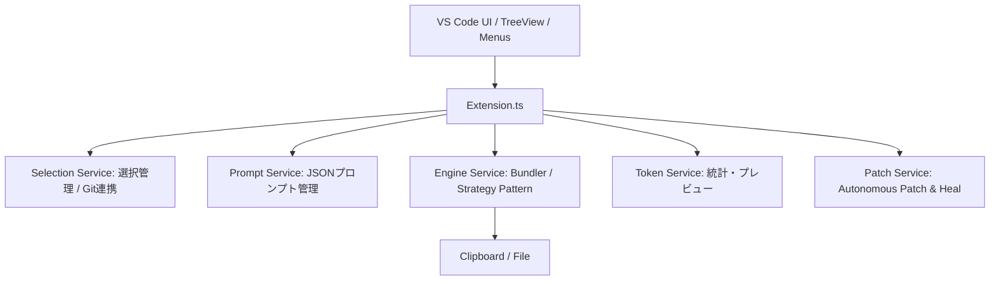

# CodePrep V2 - テクニカル・デザイン・ドキュメント

## 1. システム・アーキテクチャ (High-Level)

システムは6つの主要なサービスと、VS Code UIを制御するコントローラーで構成する。

## 2. モジュール設計（エージェントへの指示書）

### 2.1. Selection Service (Git Diff)
*   **責任**: どのファイルが選択されているかを管理する。
*   **機能**: `selectByGitDiff()`, `GitWatcher` による自動リフレッシュ。

### 2.2. Prompt Service (Prompt Injection)
*   **責任**: プロンプトのテンプレート管理と、Patch Mode 指示の自動注入。
*   **機能**: 変数置換 (`{{tree}}`, `{{datetime}}`, `{{language}}`)、およびパッチ指示の自動付与。

### 2.3. Patch Service (Autonomous Patch & Heal)
*   **責任**: AI 生成コードの自律的なマージとプレビュー。
*   **機能**:
    *   `OmitHealer`: 多重省略 (`// ... existing code ...`) の自動補完。
    *   `ClipParser`: クリップボード内の Markdown からパスとコードを抽出。
    *   `VSCodeDiff`: 変更内容を VSCode の Diff エディタで提示。

---

## 3. ロードマップ (Roadmap)

### フェーズ 1〜4: 基礎機能とパフォーマンス向上
(完了済)

### フェーズ 5: Autonomous Patch & Heal (自律パッチ適用)
> **目的**: AI の回答をローカルコードに瞬時に、かつ安全に反映させる。

*   [x] **5.1. OmitHealer の実装**: 多重省略に対応したマージロジック。
*   [x] **5.2. パッチ・プレビュー UI**: クリップボードから解析し、Diff エディタを起動。
*   [x] **5.3. プロンプト自動注入**: 常時パッチ形式を要求する設定の追加。
*   [x] **5.4. 多言語対応 (i18n)**: package.json の NLS 化と、UI の日本語/英語対応。

**【検証項目】**: AI の回答をコピーして「Preview Patch」を押した際、正しく省略箇所が復元され、Diff で意図した変更が表示されること。

---

## 4. 実装のガードレール

1.  **DDD 遵守**: ドメインロジックを UI (VSCode API) から分離する。
2.  **God-Class Killer**: 150/15/5 ルールを厳守し、単一責任原則を貫く。
3.  **多言語対応**: UI 文字列はすべて `package.nls.json` 系に外部化する。
