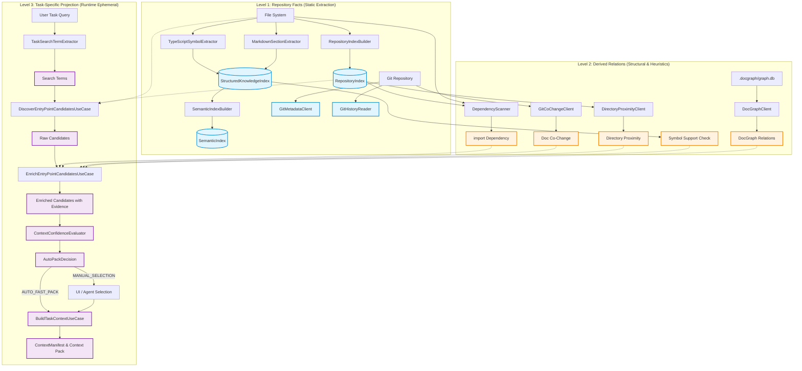

# CodePrep Phase 7A: Existing Repository Analysis Inventory & Self-Dogfooding Report

**Status:** Completed  
**Date:** 2026-09-13  
**Target Revision (HEAD):** `6825e648fd8fcb37d45b5d6b998abbf640f17b3c`  
**Execution Context:** Pre-Phase 7B (Repository IR Domain Model Design)  

---

## 1. Executive Summary

本ドキュメントは、CodePrep が現在保有している Repository 分析能力・インデックス・推薦機構・エビデンス収集パイプラインを網羅的に棚卸し（Inventory）し、次期 **Phase 7B: Repository IR (Intermediate Representation) Domain Model** の設計インプットとして体系化した調査報告書である。

### 主な結論
1. **Repository Fact の蓄積はあるが「点」に留まっている**:
   - `RepositoryIndex`（ファイル・ハッシュ・種別）、`StructuredKnowledgeIndex`（ASTシンボル宣言、Markdown見出し・本文）、`SemanticIndex`（ベクトル埋め込み）という事実情報（Facts）を抽出・保持する基盤はすでに存在する。
   - しかし、これらはファイルまたは宣言単位のフラットなスナップショットであり、シンボル間・ファイル間の関係（Relations）を持たない「孤立した点（Nodes without Edges）」である。
2. **関係（Relations）の導出は粗いヒューリスティックに依存**:
   - `DependencyScanner` は正規表現による相対 import 文字列の抽出のみで、モジュール解決（エイリアス、index.ts、拡張子解決）を行っていない。
   - `GitCoChangeClient` はドキュメントのみを対象としており、コード間の共変更を捉えられない。
   - テスト関係はファイル名の命名規則（`.test.ts`）に依存し、シンボル呼び出し（CALLS）や実装・継承（IMPLEMENTS / EXTENDS）の構造解析は完全に欠落している。
3. **Self-Dogfooding（Before Evaluation）が浮き彫りにした課題**:
   - CodePrep CLI を用いた事前評価において、本タスクに対するコンテキスト信頼度は **Low (44点)**、判定は **MANUAL_SELECTION_REQUIRED** であった。
   - 上位10件中8件がドキュメントや評価ログ（アーカイブ含む）であり、真に対象とすべき分析エンジン（`TypeScriptSymbolExtractor` 等）は上位10件中わずか1件（10%）しかヒットしなかった。
   - これは、静的テキスト一致（Lexical Match）主体の候補抽出が、ドキュメントノイズに極めて脆弱であることを実証している。
4. **Phase 7B への道筋**:
   - Repository IR は「Fact Graph（事実グラフ）」と「Derived Graph（導出グラフ）」を明確に分離し、既存の Extractor を Fact Node 生成器として再利用しつつ、呼び出し（CALLS）・型依存（TYPE_DEPENDS）・設定参照（USES_CONFIG）等の構造化 Edge を追加する設計とすべきである。

---

## 2. Inventory Methodology

### 調査手順
1. **Phase 0 (Baseline / Working Tree 確認)**:
   - Git HEAD および未コミット変更（直前の CLI / Dogfooding 実装等）の整合性を確認。
2. **Phase 1 (CodePrep CLI による Initial Projection - Dogfooding)**:
   - 実装コードの広範調査前に、CodePrep 自身の CLI（`apps/cli/index.ts`）を用いて本タスクを実行し、Initial Projection 結果を JSON 形式（`C:\Users\kimur\AppData\Local\Temp\codeprep-phase7a-before.json`）に永続化。
3. **Phase 2 (Targeted Repository Inspection)**:
   - 既存の Repository 分析機能、知識インデックス、推薦クライアント、および UseCase 実装コードを精査。
4. **Phase 3〜5 (情報分類・Producer棚卸し・パイプライン可視化)**:
   - 情報を「Repository Facts」「Derived Relations」「Task-Specific Projection」に分類し、Producer 一覧を整理。
5. **Phase 6〜8 (IR再利用性・不足構造分析・Dogfooding評価)**:
   - IR の Node/Edge への適合性を検証し、欠落している解析能力と Dogfooding 結果のギャップを分析。

### 調査対象コンポーネント
- **Domain Layer**:
  - `src/features/repository-context/domain/RepositoryIndex.ts`
  - `src/features/repository-context/domain/StructuredKnowledgeIndex.ts`
  - `src/features/repository-context/domain/CodeSymbolEntry.ts`
  - `src/features/repository-context/domain/MarkdownSectionEntry.ts`
  - `src/features/repository-context/domain/SemanticIndex.ts`
  - `src/features/repository-context/domain/EntryPointCandidate.ts`
  - `src/features/repository-context/domain/CandidateEvidence.ts`
  - `src/features/repository-context/domain/ContextConfidence.ts`
- **Application Layer**:
  - `src/features/engine/application/DependencyScanner.ts`
  - `src/features/repository-context/application/BuildRepositoryIndexUseCase.ts`
  - `src/features/repository-context/application/BuildStructuredKnowledgeIndexUseCase.ts`
  - `src/features/repository-context/application/DiscoverEntryPointCandidatesUseCase.ts`
  - `src/features/repository-context/application/CollectCandidateEvidenceUseCase.ts`
  - `src/features/repository-context/application/EnrichEntryPointCandidatesUseCase.ts`
  - `src/features/repository-context/application/PrepareTaskContextUseCase.ts`
  - `src/features/repository-context/application/BuildTaskContextUseCase.ts`
- **Infrastructure Layer**:
  - `src/features/repository-context/infrastructure/code/TypeScriptSymbolExtractor.ts`
  - `src/features/repository-context/infrastructure/code/SymbolDeclarationHandlers.ts`
  - `src/features/repository-context/infrastructure/markdown/MarkdownSectionExtractor.ts`
  - `src/features/repository-context/infrastructure/git/GitMetadataClient.ts`
  - `src/features/repository-context/infrastructure/git/GitCoChangeClient.ts`
  - `src/features/repository-context/infrastructure/git/GitHistoryReader.ts`
  - `src/features/repository-context/infrastructure/recommendation/DirectoryProximityClient.ts`
  - `src/features/repository-context/infrastructure/recommendation/DocGraphClient.ts`

---

## 3. Repository Facts (Level 1: 事実情報)

「事実（Fact）」とは、ソースコードやファイルシステム、Git履歴から決定論的に抽出可能であり、タスクやクエリに依存せず、リポジトリの改変がない限り不変である客観的データである。

| Fact カテゴリ | 保持エンティティ | 粒度 | 主な属性・スキーマ | 永続化 |
|---|---|---|---|---|
| **File Metadata** | `RepositoryFileEntry` | ファイル | `relativePath`, `fileSize`, `mtimeMs`, `contentHash` (SHA-256), `kind` (`code`, `document`, `config`, `test`, `other`) | メモリ (`RepositoryIndex`) / 将来ストア |
| **Code AST Symbols** | `CodeSymbolEntry` | シンボル宣言 (Class, Method, Func, Interface, Type, Enum, Const) | `entryId`, `projectId`, `relativePath`, `symbolKind`, `symbolName`, `containerName`, `signature`, `docComment`, `startLine`, `endLine` | メモリ (`StructuredKnowledgeIndex`) |
| **Markdown Structure** | `MarkdownSectionEntry` | ドキュメントセクション | `entryId`, `projectId`, `relativePath`, `headingLevel`, `headingText`, `headingPath` (階層パス配列), `startLine`, `endLine`, `content` | メモリ (`StructuredKnowledgeIndex`) |
| **Git File Status** | `GitMetadata` | ファイル | `modifiedPaths` (`git status --porcelain` 解析結果), `recentPaths` (直近100コミットで変更されたファイル一覧) | 非永続 (実行時取得) |
| **Git Commit History** | `GitHistoryPort` | コミット | コミットハッシュ、変更ファイル一覧 (`git show --name-only`) | 非永続 (実行時取得) |
| **Semantic Embedding** | `SemanticVectorEntry` | KnowledgeEntry単位 (シンボル/セクション) | `entryId`, `vector` (浮動小数点配列), `modelName`, `updatedAt` | メモリ (`SemanticIndex`) |

---

## 4. Derived Relations (Level 2: 導出関係)

「導出関係（Derived Relation）」とは、複数の事実（Facts）を突合・集約・計算することによって導かれる関係性やスコアである。タスク非依存な構造的関係と、タスク依存のヒューリスティックが存在するが、本レイヤでは主にリポジトリ構造から導出される関係を指す。

| 導出関係 | 実装コンポーネント | 入力 Fact | 出力 / 関係モデル | 計算手法と制約 |
|---|---|---|---|---|
| **Module Dependency** | `DependencyScanner` | ファイル内容文字列 | `DependencyEvidence` (`kind: 'dependency'`, `relatedPath`) | 正規表現 `/(?:import\|from)\s+['"](\.[^'"]+)['"]/g` による相対 import 抽出。拡張子・エイリアス未解決。 |
| **Related Test** | `CandidateEvidenceExtractors` | 全ファイルパス一覧 | `RelatedTestEvidence` (`kind: 'relatedTest'`, `relatedPath`) | ファイル名パターン比較（同名ベースの `.test.ts`, `.spec.ts` や `__tests__` 配置照合）。呼び出しの実態は未検証。 |
| **Git Co-Change** | `GitCoChangeClient` | `git log` 出力 (コミットごとのファイル一覧) | `RecommendationRecord` (`source: 'gitCoChange'`, `score`) | 過去50コミットで対象ファイルと同一コミットに含まれた回数。**制約:** 現状はドキュメントファイル (`isDocumentPath`) のみを対象としておりコード間共変更は無視。 |
| **Directory Proximity** | `DirectoryProximityClient` | ファイルパス文字列 | `RecommendationRecord` (`source: 'directoryProximity'`, `score`) | パスセグメント共通長・親ディレクトリ共有度に基づく類似度スコア (0〜100)。 |
| **Doc Graph Link** | `DocGraphClient` | `.docgraph/graph.db` (外部DB) | `DocGraphRelation` (`path`, `reason`, `confidence`) | 外部バイナリ `docgraph related` の実行結果パース。外部DBが存在しない場合は空配列。 |
| **Symbol Match Support** | `CandidateEvidenceExtractors` | `StructuredKnowledgeIndex` + Task語 | `SymbolSupportEvidence` (`kind: 'symbolSupport'`, `symbolName`) | タスク語が対象ファイル内の `CodeSymbolEntry` の名前に含まれるかの一致判定。 |

---

## 5. Task-Specific Projection (Level 3: 一時的射影)

「一時的射影（Task-Specific Projection）」とは、特定のユーザー指示・タスク文字列を受け取った瞬間に生成され、タスクの完了とともに破棄される揮発的な判断・評価・コンテキストパックである。

| 射影エンティティ | 担当コンポーネント | 入力 | 主な責務・属性 |
|---|---|---|---|
| **Task Search Terms** | `TaskSearchTermExtractor` | タスク文字列 (自然言語) | 自然言語から抽出された検索語トークン配列 (`string[]`)。 |
| **EntryPointCandidate** | `DiscoverEntryPointCandidatesUseCase` | Search Terms + 各 Source (Filename, Text, Heading, Symbol, Pin) | 初期候補ファイル一覧 (`relativePath`, `score`, `reasons`, `matchedTerms`)。 |
| **EnrichedEntryPointCandidate** | `EnrichEntryPointCandidatesUseCase` | Candidates + Evidence Sources | Evidence（依存、テスト、共変更、シンボル一致等）が付与され、`supportScore` が計算された候補。 |
| **ContextConfidence** | `ContextConfidenceEvaluator` | Enriched Candidates | 確信度評価 (`level`: `high` \| `medium` \| `low`, `score`: 0〜100, `reasons`: `clearLeader` / `strongStructuralSupport` / `weakStructuralSupport` 等)。 |
| **AutoPackDecision** | `AutoPackDecision` | ContextConfidence + Candidates | パック戦略決定 (`AUTO_FAST_PACK` \| `MANUAL_SELECTION_REQUIRED`, `strategy`: `fast` \| `standard` \| `expanded`)。 |
| **ContextManifest & Pack** | `BuildTaskContextUseCase` | Task + EntryPoints + Budget Policy | トークン予算（Budget）に基づく選定エントリ群、除外理由、および最終結合 Markdown テキスト。 |

---

## 6. Producer Inventory (網羅的テーブル)

CodePrep 内でリポジトリ分析・抽出・導出を行うコンポーネント（Producer）の全容である。

| Producer (Class/Module) | Layer | Input | Output | Granularity | Class | Persist | Store | Incremental | Provenance | Consumer | IR Cand | Notes |
|---|---|---|---|---|---|---|---|---|---|---|---|---|
| `RepositoryIndexBuilder` | Application | Workspace Root, `FileSystemPort` | `RepositoryIndex` | File | FACT | Planned | In-Memory (将来 JSON/SQLite) | Hash-based | File System / git | UseCases, CLI | **Yes** | ファイルハッシュ・種別の基盤 |
| `TypeScriptSymbolExtractor` | Infrastructure | `projectId`, `relativePath`, `content` | `CodeSymbolEntry[]` | Symbol | FACT | Planned | `StructuredKnowledgeIndex` | File-level | TS Compiler AST | KnowledgeUseCase | **Yes** | ASTから関数・クラス・型等を抽出 |
| `MarkdownSectionExtractor` | Infrastructure | `projectId`, `relativePath`, `content` | `MarkdownSectionEntry[]` | Section | FACT | Planned | `StructuredKnowledgeIndex` | File-level | Markdown AST/Line Parser | KnowledgeUseCase | **Yes** | 見出し階層と本文を抽出 |
| `SemanticIndexBuilder` | Application | `StructuredKnowledgeIndex`, `EmbeddingModelPort` | `SemanticIndex` | Entry | FACT | Planned | In-Memory (将来 Vector Store) | Entry-level | Embedder API | Search/Ranking | **Yes** | ベクトル検索用インデックス |
| `GitMetadataClient` | Infrastructure | Project Root, `git status/log` | `GitMetadata` | File | FACT | No | None (Ephemeral) | No | Git CLI | ContextUseCases | **Yes** | 変更ファイル・最近の更新ファイル |
| `GitHistoryReader` | Infrastructure | Project Root, Ref | `CommitPaths` | Commit | FACT | No | None (Ephemeral) | No | Git CLI | ContextUseCases | **Yes** | コミット詳細取得 |
| `DependencyScanner` | Application | File Path, Content, Root | `string[]` (Relative Paths) | File | DERIVED | No | None | No | Static Regex | ContextUseCases | **Extend** | 相対importの正規表現抽出のみ。モジュール解決なし |
| `GitCoChangeClient` | Infrastructure | Project Root, Target Path, `git log` | `RecommendationRecord[]` | File Pair | DERIVED | No | None | No | Git Log | CandidateEvidence | **Extend** | ドキュメント共変更のみ。コード間は未対応 |
| `DirectoryProximityClient` | Infrastructure | Project, Target Path, File List | `RecommendationRecord[]` | File Pair | DERIVED | No | None | No | Path Hierarchy | CandidateEvidence | **No** | 単純なパス距離計算 |
| `DocGraphClient` | Infrastructure | Project, Target Path, External DB | `DocGraphRelation[]` | File Pair | DERIVED | Yes | `.docgraph/graph.db` | Tool-managed | External Tool | CandidateEvidence | **Optional** | 外部バイナリ連携アダプタ |
| `FilenameAndPathCandidateSource` | Application | Terms, Project File List | `CandidateEvidence[]` | File | DERIVED | No | None | No | Path Substring Match | DiscoverUseCase | **No** | パス名テキスト検索 |
| `TextCandidateSource` | Application | Terms, Ripgrep Process | `CandidateEvidence[]` | File | DERIVED | No | None | No | Ripgrep Output | DiscoverUseCase | **No** | 全文テキスト検索 |
| `HeadingCandidateSource` | Application | Terms, Markdown Files | `CandidateEvidence[]` | File | DERIVED | No | None | No | Line Match | DiscoverUseCase | **No** | 見出しテキスト検索 |
| `SymbolCandidateSource` | Application | Terms, Ripgrep Process | `CandidateEvidence[]` | File | DERIVED | No | None | No | Ripgrep Regex | DiscoverUseCase | **No** | 定義テキスト検索 |
| `DiscoverEntryPointCandidatesUseCase` | Application | Task, Terms, Sources | `EntryPointCandidate[]` | Candidate | TASK | No | None | No | Scorer Aggregation | EnrichUseCase, CLI | **No** | タスク起点候補生成 |
| `CollectCandidateEvidenceUseCase` | Application | Task, Project, Candidate | `CandidateEvidenceBundle` | Candidate | TASK | No | None | No | Extractors | EnrichUseCase | **No** | 候補裏付け証拠収集 |
| `EnrichEntryPointCandidatesUseCase` | Application | Candidates, Evidences | `EnrichedEntryPointCandidate[]` | Candidate | TASK | No | None | No | Scorer | PrepareUseCase | **No** | 証拠付き候補生成 |
| `ContextConfidenceEvaluator` | Domain | Enriched Candidates | `ContextConfidence` | Decision | TASK | No | None | No | Rule-based Score | PrepareUseCase | **No** | 信頼度判定 |
| `BuildTaskContextUseCase` | Application | Task, EntryPoints, Budget | `ContextManifest`, Pack | Task Pack | TASK | No | None | No | Budget Policy | PrepareUseCase, Desktop | **No** | 最終コンテキスト生成 |

---

## 7. Current Analysis Pipeline (Mermaid 図)



---

## 8. IR Reusability Assessment (Repository IR への再利用性)

次期 Repository IR の設計において、既存コンポーネントおよびデータモデルがどのようにマッピング・再利用可能かを評価する。

### 8.1 そのまま / 拡張して再利用できるもの (High Reusability)
1. **`RepositoryIndex` (`RepositoryFileEntry`) -> `FileNode`**:
   - リポジトリ内のファイル一覧、サイズ、更新日時、SHA-256ハッシュ、基本種別（code/document/config/test）は、IR の最上位構造（File Node）としてそのまま活用可能。
2. **`CodeSymbolEntry` -> `SymbolNode`**:
   - AST から抽出されるクラス、インターフェース、関数、メソッド、型、列挙型、定数宣言の情報（名前、シグネチャ、docComment、開始/終了行）は、IR の構文ノード（Symbol Node）として直ちに利用可能。
   - **拡張点:** エクスポート有無（`isExported`）、アクセス修飾子（public/private）、型引数（Generics）の追加が望ましい。
3. **`MarkdownSectionEntry` -> `DocSectionNode`**:
   - 見出しレベル、階層パス（headingPath）、本文、開始/終了行は、ドキュメント構造ノード（Document Node）として完全に適合。
4. **`SemanticIndex` -> `VectorEmbeddingAttribute`**:
   - シンボルやセクションの EntryId をキーとする埋め込みベクトルは、IR の各ノードに付与するセマンティック属性として再利用可能。

### 8.2 拡張・再実装が必要なもの (Needs Refactoring / Extension)
1. **`DependencyScanner` -> `ImportsEdge` / `ExportsEdge`**:
   - 現状の正規表現ベースの実装はエイリアス（tsconfig path mapping）や拡張子解決ができないため、TypeScript AST またはモジュールリゾルバを用いた厳密なモジュール依存解析（`DEPENDS_ON` Edge）への置き換えが必要。
2. **`GitCoChangeClient` -> `CoChangedWithEdge`**:
   - ドキュメント限定の制限を撤廃し、コードファイル間（例: `A.ts` と `A.test.ts`、`UseCase.ts` と `Ports.ts`）の共変更関係を Edge として保持できるように拡張する必要がある。

### 8.3 IR へのマッピング方針 (Node / Edge 定義案)

```
[Repository IR Core Schema]
├── Nodes
│   ├── FileNode (from RepositoryIndex)
│   ├── SymbolNode (from CodeSymbolEntry)
│   └── DocSectionNode (from MarkdownSectionEntry)
└── Edges
    ├── CONTAINS (File -> Symbol, File -> DocSection, Class -> Method)
    ├── DEPENDS_ON / IMPORTS (File -> File, Symbol -> Symbol)
    ├── CO_CHANGED_WITH (File <-> File)
    └── (不足している新規 Edge: CALLS, IMPLEMENTS, TESTS, USES_CONFIG 等)
```

---

## 9. Missing Structural Analyses (不足している構造分析)

現在 CodePrep に完全に欠落しており、Repository IR で新規に導入すべき構造関係（Edges）の分析である。

### 9.1 `CALLS` (関数・メソッド呼び出し関係)
- **現状:** 存在しない。どの関数がどの関数を呼んでいるか全く把握できない。
- **影響:** ある UseCase を変更する際、その内部で呼ばれているドメインモデルやヘルパー関数を追尾できず、コンテキストから漏れる。
- **IR での要件:** `SymbolNode -(CALLS)-> SymbolNode`。最低限、同一ファイル内および直接 import されたシンボルの呼び出しを静的に解決する。

### 9.2 `IMPLEMENTS` / `EXTENDS` (インターフェース実装・クラス継承関係)
- **現状:** 存在しない。`symbolKind: 'interface'` や `class` は存在するが、誰がそのインターフェースを実装しているか（Ports と Adapters の関係）を追跡できない。
- **影響:** アーキテクチャ上極めて重要な「ポートとアダプタの対応（例: `GitMetadataPort` を実装する `GitMetadataClient`）」が自動解決できない。
- **IR での要件:** `SymbolNode -(IMPLEMENTS)-> SymbolNode`, `SymbolNode -(EXTENDS)-> SymbolNode`。

### 9.3 `TESTS` (テストコードと被テストコードの細粒度対応)
- **現状:** ファイル名マッチ（`Foo.ts` に対する `Foo.test.ts`）のみ。
- **影響:** 1つのテストファイルが複数のドメインクラスをテストしている場合や、結合テスト、シナリオテストの依存が解決できない。
- **IR での要件:** `FileNode -(TESTS)-> FileNode`, または `SymbolNode (Test Block) -(TESTS)-> SymbolNode`。

### 9.4 `USES_CONFIG` (設定ファイル・環境変数の参照関係)
- **現状:** 存在しない。`package.json`, `tsconfig.json`, `.env` 等との関係は未解析。
- **影響:** ビルド設定やスクリプトコマンド、環境変数キーがどのコードで参照されているかが不明。
- **IR での要件:** `FileNode -(USES_CONFIG)-> FileNode (config)`。

### 9.5 `READS_FILE` / `WRITES_FILE` (静的アセット・リソースの参照関係)
- **現状:** 存在しない。
- **影響:** テンプレートファイル、JSON スキーマ、SQL ファイル、静的アセットの依存関係が追跡できない。

---

## 10. Self-Dogfooding Evaluation (Before Evaluation の分析)

### 10.1 実行概要
- **実行日時:** 2026-09-13T18:08:45
- **実行コマンド:**
  ```powershell
  npx ts-node apps/cli/index.ts `
    --task "CodePrepの既存Repository分析機能を棚卸しし、Repository IRとして再利用できる分析結果と不足している構造分析を特定する" `
    --format json `
    --output "$env:TEMP\codeprep-phase7a-before.json"
  ```
- **生出力保存先:** `C:\Users\kimur\AppData\Local\Temp\codeprep-phase7a-before.json`

### 10.2 実行結果サマリー
```json
{
  "decision": "MANUAL_SELECTION_REQUIRED",
  "confidence": {
    "level": "low",
    "score": 44,
    "reasons": ["weakStructuralSupport"]
  },
  "requiresSelection": true,
  "strategy": "expanded",
  "candidates": [
    { "relativePath": "Requirements.md", "score": 140, "supportScore": 0 },
    { "relativePath": "docs/doc-indexer/requirements.md", "score": 105, "supportScore": 0 },
    { "relativePath": "docs/evaluations/phase-6e-kairos-sonnet-exploration.md", "score": 105, "supportScore": 0 },
    { "relativePath": "evaluation/kairos-exploration/traces/TASK-01-sonnet-codeprep.jsonl", "score": 85, "supportScore": 0 },
    { "relativePath": "src/features/repository-context/infrastructure/recommendation/__tests__/DirectoryProximityClient.test.ts", "score": 85, "supportScore": 40 },
    { "relativePath": "src/features/repository-context/infrastructure/recommendation/DirectoryProximityClient.ts", "score": 85, "supportScore": 0 },
    { "relativePath": "AGENTS.md", "score": 80, "supportScore": 0 },
    { "relativePath": "CLAUDE.md", "score": 80, "supportScore": 0 },
    { "relativePath": "README.en.md", "score": 80, "supportScore": 0 },
    { "relativePath": "README.md", "score": 80, "supportScore": 0 }
  ]
}
```

### 10.3 分析と課題（Why did it fail?）

#### 1. 抽出された検索キーワードの限界
- 抽出された語: `["IR", "CodePrep", "Repository", "特定", "既存"]`
- **問題点:** 日本語形態素解析器を持たないため、タスク文から「Repository」「IR」といった広範な抽象名詞や「特定」「既存」などの一般的動詞・形容詞がキーワードとして抽出された。

#### 2. ドキュメント・アーカイブ汚染 (Docs / Trace Noise)
- 「IR」「Repository」などの単語は、要件定義書（`Requirements.md`）や過去の実験ログ（`phase-6e-...md`）、評価トレース（`TASK-01-...jsonl`）の見出しや本文に大量に出現する。
- その結果、上位4件すべてがドキュメントやログファイルで占められ、本来の目的である実装コードが押し出された。

#### 3. 真の分析対象コードの欠落 (Zero Hit on Real Engines)
- 今回の棚卸しで最も重要だった以下のコア実装は、上位10件に **1つも含まれなかった**:
  - `src/features/repository-context/infrastructure/code/TypeScriptSymbolExtractor.ts`
  - `src/features/repository-context/infrastructure/markdown/MarkdownSectionExtractor.ts`
  - `src/features/engine/application/DependencyScanner.ts`
  - `src/features/repository-context/infrastructure/git/GitCoChangeClient.ts`
  - `src/features/repository-context/domain/RepositoryIndex.ts`
  - `src/features/repository-context/application/DiscoverEntryPointCandidatesUseCase.ts`
- 唯一コード層でヒットしたのは `DirectoryProximityClient.ts`（およびテスト）のみであった。
- **追加発見率 (Additional Discovery Rate):**
  $$\text{Hit Rate} = \frac{\text{真に関連する実装ファイル}}{\text{提示された上位10候補}} = \frac{1}{10} = 10\%$$
  残り 90% の重要コードは、AI Agent が自力で探索（Targeted Inspection）して発見しなければならなかった。

#### 4. 構造的サポート（Evidence）の欠如
- ヒットした上位候補の大半が `supportScore: 0`、`evidence: []` であった。
- 唯一 `DirectoryProximityClient.test.ts` だけが `dependency` エビデンス（`DirectoryProximityClient.ts` への import）を持っていたが、それ以外のドキュメント群は孤立しており、これが総合判定 `low (44点)`、`weakStructuralSupport` の主因となった。

---

## 11. Risks and Constraints for Phase 7B

Phase 7B で Repository IR Domain Model を設計・実装するにあたり、遵守・克服すべき制約事項とリスクである。

1. **God-Class Killer Policy (厳格な規約制約)**:
   - **1ファイル150行以内、1関数15行以内（目標10行以内）、循環的複雑度5以内**。
   - IR のグラフ構造やノード・エッジのビルダーは巨大化（God Class化）しやすいため、エンティティ定義、バリデーション、ビルダー、シリアライザを細かくファイル分割するアーキテクチャ設計が必須。
2. **パフォーマンスとメモリ消費**:
   - リポジトリ全ファイルの AST パースおよびシンボル・呼び出しグラフの構築は、大規模リポジトリにおいて数万ノード・数十万エッジに達する可能性がある。
   - インメモリに保持するデータ構造のコンパクト化（オブジェクトの重複排除、ID参照化）と、非同期チャンク処理による UI スレッド凍結防止が不可欠。
3. **インクリメンタル更新（差分解析）の複雑性**:
   - ファイル1つの変更に対して全グラフを再構築するのは非現実的である。
   - `contentHash` を用いたファイル単位の差分検知と、影響を受ける Edge の局所更新機構を設計に組み込む必要がある。
4. **モジュール解決の環境依存性**:
   - `tsconfig.json` の `paths` や Node.js の `exports` フィールドなど、プロジェクトごとの解決ルールをどう抽象化して取り扱うかの設計難度が高い。

---

## 12. Phase 7B Actionable Inputs

Phase 7B の設計者が直ちに着手すべき具体的論点と推奨アクションである。

### 論点 1: Fact Graph と Derived Graph の分離モデル
- **提案:** IR を単一のフラットなグラフにするのではなく、静的抽出による「Fact Graph（File, Symbol, DocSection と CONTAINS エッジ）」と、関係解析による「Derived Graph（CALLS, IMPORTS, IMPLEMENTS, CO_CHANGED_WITH エッジ）」の2層に明確に分離する。
- **理由:** 差分更新の局所化（Fact はファイル単位で更新可能、Derived は影響波及を計算）およびキャッシュ永続化が容易になる。

### 論点 2: Core Node / Edge スキーマ定義
Phase 7B で最初に定義すべき最小限の型定義セット:
- **Nodes:**
  - `FileNode`: `id`, `path`, `kind`, `hash`, `mtime`, `size`
  - `SymbolNode`: `id`, `fileId`, `symbolKind`, `name`, `signature`, `docComment`, `range`
  - `DocSectionNode`: `id`, `fileId`, `level`, `heading`, `path`, `range`
- **Edges:**
  - `CONTAINS`: 親ノードから子ノードへの包含
  - `IMPORTS`: ファイル・シンボル間のモジュールインポート
  - `CALLS`: 呼び出し関係（Phase 7B では最小限の同ファイル・直接import対象から着手）
  - `IMPLEMENTS`: クラスとインターフェースの対応

### 論点 3: 永続化とシリアライゼーションの方式
- In-Memory Map と JSON / SQLite 等のストレージとの境界（Ports & Adapters）を定義し、VSCode 拡張機能ホストのメモリを圧迫しない設計とする。

### 論点 4: Dogfooding 改善のための除外・重み付けフィルタ
- 探索時に `evaluation/`, `archive/`, `dist/` などのノイズパスを適切に除外・降格する `PathFilterPolicy` を導入し、ドキュメント汚染を防ぐ。

---

## 13. Traceability Matrix

| 要件 / 論点 | 参照元ソースコード | 参照元ドキュメント / ログ | Phase 7B 反映先 |
|---|---|---|---|
| ファイル事実 (File Facts) | `domain/RepositoryIndex.ts` | `Requirements.md` | `IR.FileNode` |
| シンボル事実 (Symbol Facts) | `infrastructure/code/TypeScriptSymbolExtractor.ts` | `AGENTS.md` (DDD原則) | `IR.SymbolNode` |
| ドキュメント事実 (Doc Facts) | `infrastructure/markdown/MarkdownSectionExtractor.ts` | `docs/doc-indexer/requirements.md` | `IR.DocSectionNode` |
| 依存関係導出 (Dependency) | `engine/application/DependencyScanner.ts` | Phase 7A Report Section 4 | `IR.ImportsEdge` (拡張改修) |
| 共変更関係導出 (Co-Change) | `infrastructure/git/GitCoChangeClient.ts` | Phase 7A Report Section 4 | `IR.CoChangedWithEdge` (コード拡張) |
| ドキュメントグラフ (DocGraph) | `infrastructure/recommendation/DocGraphClient.ts` | Phase 7A Report Section 4 | 外部オプショナル Edge |
| 呼び出し・実装の不足 (Missing) | なし (新規設計) | Phase 7A Report Section 9 | `IR.CallsEdge`, `IR.ImplementsEdge` |
| Self-Dogfooding 評価 (Before) | `apps/cli/index.ts` | `C:\Users\kimur\AppData\Local\Temp\codeprep-phase7a-before.json` | 検索フィルタ / 重み付け改善 |
