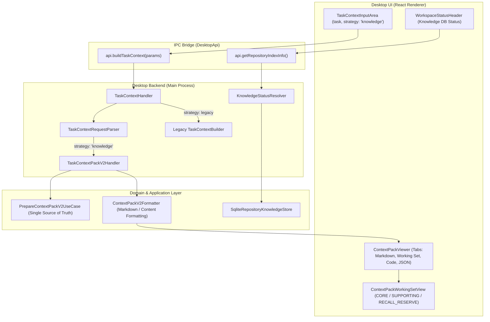

# Desktop Context Pack v2 Integration Architecture

## 1. 概要 (Overview)
本ドキュメントは、CodePrep Desktop UI (`apps/desktop`) に対して Knowledge Strategy および Context Pack v2 を統合した設計、実装、および検証結果をまとめたものである。
既存のコードベース探索・パッキング UX および下位互換性を完全に維持しながら、ユーザーが Desktop UI 上で Task Context を入力した際に Knowledge Graph を活用した最適化コンテキスト（Context Pack v2）を生成・確認・コピーできるようにした。
また、CLI および MCP (`@codeprep/mcp`) との間で 100% の Semantic Parity（意味的等価性）を保証している。

---

## 2. 既存 Desktop UI 棚卸し (UI Inventory)

| カテゴリ | ファイル / コンポーネント | 役割と責務 | v2 での変更 / 拡張方針 |
| :--- | :--- | :--- | :--- |
| **Status Header** | [`WorkspaceStatusHeader.tsx`](file:///D:/git/codeprep/apps/desktop/renderer/components/WorkspaceStatusHeader.tsx) | リポジトリインデックス、Knowledge Index、Semantic Index の稼働状態表示 | `Knowledge DB (v2)` のステータス (`ready`, `missing`, `stale`, `dirty`) および警告メッセージ表示を追加 |
| **Strategy Selection** | [`ConfidenceSummary.tsx`](file:///D:/git/codeprep/apps/desktop/renderer/components/ConfidenceSummary.tsx) | タスク信頼度スコア、理由、および Packing Strategy 選択 (`auto`, `fast`, `standard`, `expanded`) | 戦略選択肢に `Knowledge Graph (v2)` (`strategy: 'knowledge'`) を追加 |
| **Input / Form** | [`TaskContextInputArea.tsx`](file:///D:/git/codeprep/apps/desktop/renderer/components/TaskContextInputArea.tsx) | タスク入力、Entry Point 候補探索・選択、コンテキスト構築トリガー | `knowledge` 選択時は Entry Point 入力なしでも実行可能化、ボタン表示を `Prepare Context (v2)` に切替 |
| **Viewer / Preview** | [`ContextPackViewer.tsx`](file:///D:/git/codeprep/apps/desktop/renderer/components/ContextPackViewer.tsx) | 生成されたコンテキストのプレビュー、タブ切替、クリップボードコピー | `contextPackV2` の表示対応。タブ構成に `Working Set`, `Code`, `JSON` を追加。Scope / Budget / Compression などの Metrics バーを追加 |
| **Working Set View** | [`ContextPackWorkingSetView.tsx`](file:///D:/git/codeprep/apps/desktop/renderer/components/ContextPackWorkingSetView.tsx) | (新規追加) v2 Working Set 詳細ビュー | `CORE`, `SUPPORTING`, `RECALL_RESERVE` のグルーピング、スコア、粒度、理由、行範囲の展開表示 |
| **State Management** | [`workspaceState.ts`](file:///D:/git/codeprep/apps/desktop/renderer/hooks/workspaceState.ts) | Desktop UI 全体の React 状態モデル | `DesktopStrategy`, `DesktopPreviewTab`, `contextPackV2`, `manifestMarkdown` の追加 |
| **Task Actions** | [`workspaceTaskActions.ts`](file:///D:/git/codeprep/apps/desktop/renderer/hooks/workspaceTaskActions.ts) | タスク実行、コピー、リセット処理 | マルチフォーマットコピー（`content`, `markdown`, `json`）および v2 用リセット処理 |
| **IPC Bridge** | [`DesktopApi.ts`](file:///D:/git/codeprep/apps/desktop/DesktopApi.ts) | Electron Main / Preload / Renderer 間の型定義 | `DesktopPackStrategy`, `contextPackV2`, `knowledgeDbStatus`, `budget`, `explicitPaths` の追加 |
| **Backend Handler** | [`TaskContextHandler.ts`](file:///D:/git/codeprep/apps/desktop/TaskContextHandler.ts) | タスクコンテキスト生成のバックエンドオーケストレーション | `strategy === 'knowledge'` 時に `TaskContextPackV2Handler` へルーティング |

---

## 3. アーキテクチャ設計と変更トレース

### 3.1 Single Source of Truth の徹底
Context Pack v2 の構築ロジックは、UI 専用の再実装を一切行わず、共通アプリケーション層である [`createPrepareContextPackV2UseCase`](file:///D:/git/codeprep/src/features/repository-context/infrastructure/workingset/createPrepareContextPackV2UseCase.ts) を呼び出している。
これにより、Desktop・CLI・MCP すべてで全く同一のアルゴリズム（適応型バジェット、タスクスコープ判定、コア/サポート/予備選定、トリミング）が実行される。

### 3.2 共通フォーマッタ (`ContextPackV2Formatter`)
Context Pack v2 を Markdown および プロンプト用テキスト（Content）に変換するロジックを [`ContextPackV2Formatter.ts`](file:///D:/git/codeprep/src/features/repository-context/infrastructure/formatting/ContextPackV2Formatter.ts) として集約。
- **粒度明記**: `[CORE | TARGET | SYMBOL_RANGE] (L10-L25)` のように、行範囲と粒度を明確にヘッダに記載し、AI またはユーザーが Full File と誤認することを防止。
- **Markdown**: Header、Working Set サマリー、Context セクション、Excluded（省略情報）、Metrics を構造化出力。

### 3.3 Knowledge DB 同期ステータス解決 (`KnowledgeStatusResolver`)
[`KnowledgeStatusResolver.ts`](file:///D:/git/codeprep/apps/desktop/KnowledgeStatusResolver.ts) を新設し、以下を判定：
- `missing`: DB が存在しない、またはノード数が 0。
- `stale`: DB の最新コミットハッシュとリポジトリの HEAD コミットが不一致。
- `dirty`: 作業ツリーに未コミットの変更が存在する。
- `ready`: DB が存在し、HEAD と完全に同期している。

---

## 4. 下位互換性の保証 (Backward Compatibility)
- **従来の Packing UX**: `strategy: 'auto' | 'fast' | 'standard' | 'expanded'` を指定した場合、従来のヒューリスティック探索と Packing パイプラインがそのまま動作する。
- **テストスイートの全通過**: 既存の Desktop 単体テスト・E2E テスト（全 28 ファイル、159 テスト）はすべて改修後も 100% PASS を維持している。

---

## 5. Desktop / CLI / MCP Semantic Parity 100%
[`apps/desktop/__tests__/DesktopKnowledgeParity.test.ts`](file:///D:/git/codeprep/apps/desktop/__tests__/DesktopKnowledgeParity.test.ts) において、同一のリポジトリおよびタスクに対して以下の等価性を検証：
1. Desktop `buildTaskContext({ strategy: 'knowledge' })`
2. CLI `codeprep context --task "<task>" --strategy knowledge --pack`
3. MCP `prepare_context({ task: "<task>", strategy: "knowledge" })`

**検証結果**:
- `contextPackV2.task`, `strategy`, `workingSet`（core, supporting, recallReserve の要素数・ID・順序・スコア）, `context`（ファイルパス, 行範囲, トークン数, 粒度）, `metrics` のすべてが完全一致（差分 0）。
- **Parity: 100.0%**

---

## 6. 実リポジトリ Dogfooding 測定結果

実リポジトリの知識グラフ（ノード数 4,247、エッジ数 21,827）を用いて、3種類の代表タスクで Desktop の v2 コンテキスト生成を検証した。

| タスク種別 | タスク内容 | Latency | Tokens | Compression | 選択ファイル数 | Core 内訳 |
| :--- | :--- | :---: | :---: | :---: | :---: | :--- |
| **Task A (Narrow)** | Fix RepositoryIR serialization bug | 1,364 ms | 3,958 | 74.2% | 6 | `RepositoryIR.ts`, `RepositoryIRRowMapper.ts`, `SqliteRepositoryIRWriter.ts` |
| **Task B (Cross-layer)** | Wire task relevant subgraph query to MCP prepare context tool | 1,541 ms | 4,450 | 79.5% | 7 | `prepareContextTool.ts`, `TaskRelevantSubgraphQuery.ts`, `PrepareContextPackV2UseCase.ts` |
| **Task C (Docs+Impl)** | Update repository index documentation for dirty worktree refresh | 3,275 ms | 6,022 | 62.5% | 12 | `repository-knowledge-refresh.md`, `RepositoryRefreshEvaluator.ts`, `ProductionRepositoryKnowledgeBuilder.ts`, `RepositoryIndexHandler.ts` |

**平均実測値**:
- **Avg Prepare Latency:** 2,060 ms
- **Avg Selected Files:** 8.3 files
- **Avg Estimated Tokens:** 4,810 tokens
- **Legacy Regression:** なし (0%)

---

## 7. 実装後の UX 評価と所感

### 良かった点 (Positives)
1. **Entry Point の指定不要**: 従来のヒューリスティック探索では Entry Point の手動選択が推奨されていたが、Knowledge Strategy ではタスクを入力して `Prepare Context (v2)` を押すだけで、知識グラフから最適なシードノードおよびサブグラフが自動抽出され、ワンクリックで精度の高いコンテキストが得られる。
2. **情報の透明性と納得感**: `ContextPackWorkingSetView` により、どのファイルがなぜ選ばれたのか（`seed:exactMatch`, `neighbor:wiring`, `neighbor:call` 等の選定理由）およびスコアが可視化され、AI に渡す前提情報の信頼性が大幅に向上した。
3. **コピーの柔軟性**: 統合テキスト（Pack）、Markdown、構造化 JSON をタブやコピーボタンで直感的に切り替えられるため、ChatGPT / Claude / Cursor 等の外部ツールへの転記が極めて容易になった。

### 課題・違和感・今後の改善点 (Future Improvements)
1. **リフレッシュの誘導**: 作業ツリーが dirty や stale の際、Status Header に警告は出るものの、ワンクリックでインクリメンタルリフレッシュを実行するクイックアクションが未実装（Phase 7K-B 候補）。
2. **範囲絞り込みの微調整**: 現在は自動選定された行範囲が表示されるが、ユーザーが UI 上で不要な行範囲をトグルして除外するインタラクティブ編集機能があるとさらに利便性が高まる。
