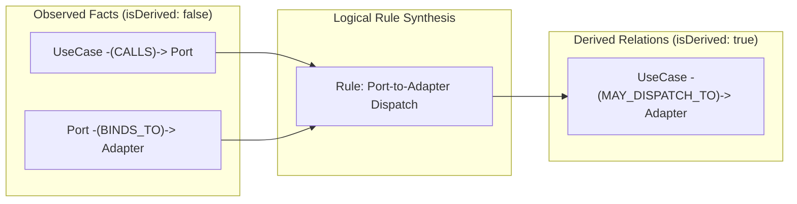

# CodePrep Phase 7B: Repository IR Domain Model Specification

**Status:** Approved  
**Date:** 2026-09-13  
**Target Revision (Baseline):** `4bfed62b33a1ab933f5e290975f774e58a1c1c27`  
**Phase Context:** Phase 7B (Repository IR Domain Model / Language & Framework Analysis Ready)  

---

## 1. Goals / Non-goals

### Goals
- **リポジトリ構造の統合中間表現 (Repository IR) の Domain Contract 策定**:
  - Phase 7A で棚卸しした事実情報（Facts）および導出関係（Derived Relations）を統合し、タスク非依存・言語非依存なグラフ構造として表現するコア Domain 型を確立する。
- **多様な Producer に対する統合受け口の提供**:
  - 将来導入される LSP（Language Server Protocol）、AST 解析器、DI / Framework 配線アナライザー、設定ファイル解析器、Git 履歴アナライザーが同一の Contract にデータを注入できるようにする。
- **事実（Facts）と導出関係（Derived Relations）の明確な分離**:
  - 直接観測された言語事実や配線事実と、複数事実から導出された関係（例: `MAY_DISPATCH_TO`）を混同・合算せず、出自（Provenance）と導出元の追跡可能性を保証する。

### Non-goals (本フェーズで実装しないもの)
- データベース永続化（SQLite / Vector DB / JSON ファイルストレージ等）の実装
- 具体的な LSP クライアントや Tree-sitter / TypeScript Compiler API 統合アナライザーの実装
- 具体的な DI / Framework アナライザーの実装
- Task-specific Projection（タスクスコアリング、コンテキストパック構築）の IR への内包
- 既存 Producer から IR への Mapper 実装（次期 Phase 7C のスコープ）

---

## 2. Task-independent Boundary

Repository IR は **「リポジトリについて既知のこと（What is known about the repository）」** を表現するモデルであり、ユーザーが与える個別のタスクやプロンプトから完全に独立（Task-independent）している。

### 境界定義
```
+-------------------------------------------------------------------------+
|                  Level 3: Task-Specific Projection Layer                |
|  - EntryPointCandidate ranking          - TaskSearchTerms               |
|  - Candidate support score              - ContextConfidence             |
|  - AutoPackDecision                     - ContextManifest / Pack        |
+-------------------------------------------------------------------------+
                                     |
               Query / Project via Policy (e.g. PathFilterPolicy)
                                     v
+=========================================================================+
|                  Level 1 & 2: Repository IR (Core Domain)               |
|  - RepositorySnapshot (リポジトリ状態・リビジョン・ワークスペース識別)       |
|  - RepositoryNode     (FILE, SYMBOL, DOC_SECTION, CONFIG, TEST etc.)    |
|  - RepositoryEdge     (CONTAINS, CALLS, IMPLEMENTS, BINDS_TO etc.)      |
|  - RepositoryEvidence (Provenance, Analyzer, Category, Confidence)     |
+=========================================================================+
                                     ^
                         Extracted / Produced by
                                     |
+-------------------------------------------------------------------------+
|                         Producers & Analyzers                           |
|  - LSP Adapter           - AST Extractor         - DI Framework Analyzer|
|  - Git Log Client        - DocGraph Adapter      - Config Scanner       |
+-------------------------------------------------------------------------+
```

### 排除原則
以下のタスク依存要素は Repository IR Core に一切含めない：
- `EntryPointCandidate` およびそのスコア・順位
- `matchedTerms`（タスク文字列とのトークン一致情報）
- `ContextConfidence`（タスク解決の確信度）
- `AutoPackDecision`（AUTO_FAST_PACK 等のパック戦略決定）
- `ContextManifest` / `TaskContextPack`（LLM 向け最終トークン予算枠）

---

## 3. Node Model (`RepositoryNode`)

### スキーマ定義
```typescript
export interface RepositoryNode {
  readonly id: string;
  readonly snapshotId: string;
  readonly kind: RepositoryNodeKind;
  readonly name: string;
  readonly path: string;
  readonly location?: RepositoryLocation;
  readonly language?: string;
  readonly metadata?: Readonly<Record<string, unknown>>;
}
```

### 標準 Node Kinds (`RepositoryNodeKind`)
- `file`: ソースコード、ドキュメント、設定ファイル等のファイル実体
- `symbol`: クラス、インターフェース、関数、メソッド、型エイリアス、列挙型、定数
- `doc-section`: Markdown やドキュメントファイル内の見出しセクション
- `config`: 設定ファイル内の構成定義（例: `tsconfig.json` の paths 設定）
- `test`: テストスイート（`describe`）やテストケース（`it` / `test`）
- `entry-point`: 外部公開される真のエントリポイント（CLI コマンド、拡張機能のエントリ関数等）
- `persistence`: DB テーブル定義、スキーマエンティティ等

### Node ID の安定性設計 (Stable Identity)
差分解析（インクリメンタル更新）およびキャッシュ永続化に耐えうるよう、連番 ID は廃止し、以下の階層的 URI 形式を採用する：
- **File Node:** `node:<snapshotId>:file:<normalizedRelativePath>`
  - 例: `node:snap-1:file:src/features/selection/ClipboardSelectionUseCase.ts`
- **Symbol Node:** `node:<snapshotId>:sym:<normalizedRelativePath>#<symbolKind>:<symbolName>[:<startLine>]`
  - 例: `node:snap-1:sym:src/features/selection/ClipboardSelectionUseCase.ts#method:resolve:45`

---

## 4. Edge Model (`RepositoryEdge`)

### スキーマ定義
```typescript
export interface RepositoryEdge {
  readonly id: string;
  readonly snapshotId: string;
  readonly sourceNodeId: string;
  readonly targetNodeId: string;
  readonly relationType: RepositoryRelationType;
  readonly isDerived: boolean;
  readonly evidences: readonly RepositoryEvidence[];
  readonly confidence: number;
  readonly metadata?: Readonly<Record<string, unknown>>;
}
```

### 標準 Relation Types (`RepositoryRelationType`)
| Relation Type | 分類 | 意味・対象ノード |
|---|---|---|
| `contains` | Fact | 包含関係（File -> Symbol, File -> DocSection, Class -> Method） |
| `depends-on` | Fact / Derived | モジュールレベル依存（File -> File） |
| `references` | Fact | 一般的なシンボル参照（Symbol -> Symbol） |
| `calls` | Fact | 関数・メソッド呼び出し（Symbol -> Symbol） |
| `implements` | Fact | インターフェース実装（Class Symbol -> Interface Symbol） |
| `extends` | Fact | クラスまたはインターフェースの継承（Symbol -> Symbol） |
| `tests` | Fact / Derived | テストによる検証関係（Test Node -> Target Node） |
| `binds-to` | Fact | DI コンテナにおけるインターフェースと実装のバインディング |
| `injects` | Fact | クラスやハンドラに対する依存インスタンスの注入 |
| `uses-config` | Fact | 設定項目や環境変数の参照（Symbol / File -> Config Node） |
| `reads` | Fact | 静的ファイルやリソースの読み込み |
| `writes` | Fact | 出力ファイルやリソースの書き込み |
| `co-changed-with` | Derived | Git コミット履歴に基づく共変更相関 |
| `doc-relation` | Derived | 外部ドキュメントグラフツール（DocGraph 等）による関連 |
| `may-dispatch-to` | Derived | CALLS と BINDS_TO から導出される動的ディスパッチ先 |

---

## 5. Evidence & Provenance Model (`RepositoryEvidence`)

### スキーマ定義
```typescript
export interface RepositoryEvidence {
  readonly id: string;
  readonly category: EvidenceProvenanceCategory;
  readonly analyzer: string;
  readonly confidence: number;
  readonly sourcePath?: string;
  readonly sourceLocation?: RepositoryLocation;
  readonly derivation?: EvidenceDerivationInfo;
  readonly details?: Readonly<Record<string, unknown>>;
  readonly createdAt?: string;
}
```

### Provenance カテゴリ (`EvidenceProvenanceCategory`)
万能スコアへの埋没を防ぎ、エビデンスの性質を厳密に区別する：
- `deterministic-ast`: 決定論的 AST 静的解析（確信度 1.0）
- `language-server`: LSP（TypeScript Language Server 等）の型・参照インテリジェンス
- `framework-analyzer`: 手動 Composition、NestJS、Inversify、Spring 等の配線解析
- `regex-pattern`: 正規表現によるテキスト抽出（簡易依存関係等）
- `git-history`: Git コミットログの集計・統計相関
- `semantic-vector`: 埋め込みベクトル類似度（コサイン距離等）
- `heuristic`: ディレクトリ距離や命名規則ヒューリスティック
- `rule-derived`: 複数の既存エッジを論理合成して導出されたエビデンス

---

## 6. Snapshot & Revision Model (`RepositorySnapshot`)

### スキーマ定義
```typescript
export interface RepositorySnapshot {
  readonly snapshotId: string;
  readonly repositoryId: string;
  readonly revision?: string;
  readonly workspaceRoot: string;
  readonly createdAt: string;
  readonly metadata?: Readonly<Record<string, unknown>>;
}
```

### Non-Git Workspace 耐性
- `revision` はオプショナル (`string | undefined`) であり、Git 管理外のフォルダであっても `snapshotId` と `workspaceRoot` により一意にスナップショットを管理可能。
- スナップショット間で Edge が交差（Cross-snapshot）することは Domain Invariant により厳格に禁止される。

---

## 7. Fact vs Derived Relation

Repository IR では、観測された客観的事実と、そこから計算・推論された導出関係を明確に区別する。



- **Fact Edge (`isDerived: false`)**:
  - 単一のソースファイルや Git 履歴から直接抽出された関係。
  - 例: `CALLS`, `IMPLEMENTS`, `BINDS_TO`, `CONTAINS`。
- **Derived Edge (`isDerived: true`)**:
  - 複数の事実エッジまたは外部相関を組み合わせて合成された関係。
  - 必須条件: `evidences` に少なくとも1つの `rule-derived` エビデンスを含み、`derivation.derivedFromEdgeIds` によって元の事実エッジを追跡可能であること。

---

## 8. LSP Integration Boundary

LSP は Core Domain ではなく、**Infrastructure / Adapter 層の Producer** として位置づける。

```
[Repository IR Core]
        ^
        | (injects RepositoryNode / RepositoryEdge)
[Language Intelligence Port]
        ^
        | implements
[LSP Adapter] (e.g. TypeScriptLanguageServerClient, PyrightClient)
```

### Capability-driven Port 設計方針
LSP サーバーごとに提供機能が異なるため、全 capability を必須と仮定せず、以下のように段階的に提供可能なポートとして設計する：
- `supportsSymbols()`: ドキュメントシンボルの抽出
- `supportsReferences()`: シンボル参照（`REFERENCES` Edge）
- `supportsCallHierarchy()`: 呼び出し階層（`CALLS` Edge）
- `supportsTypeHierarchy()`: 型階層（`IMPLEMENTS` / `EXTENDS` Edge）

---

## 9. DI / Framework Integration Boundary

DI コンテナやフレームワーク固有の配線は、LSP の静的型解決だけでは追尾できない。そのため、専用の Framework Analyzer を独立した Producer として設計する。

### 基本方針
- **Core Domain にフレームワーク固有の語彙を持ち込まない**:
  - `SpringBindingNode` や `NestJsModuleEdge` 等の命名は厳禁。
  - Core は `BINDS_TO`（インターフェースと実装の束縛）および `INJECTS`（インスタンス注入）という普遍的概念のみを定義する。
- **将来の Producer 例**:
  - `ManualCompositionAnalyzer`: 手動 DI ファクトリ（CodePrep 自身の `RepositoryContextContainer` 等）を解析
  - `NestJsBindingAnalyzer`: `@Module({ providers: [...] })` デコレータを解析
  - `InversifyBindingAnalyzer`: `bind(TYPES.Foo).to(FooImpl)` を解析
  - `SpringBindingAnalyzer`: `@Component`, `@Autowired` 等の Java アノテーションを解析

---

## 10. Existing Model Mapping

Phase 7A の棚卸し結果を踏まえた、既存データモデルから Repository IR へのマッピング方針である。

| 既存モデル / Producer | IR Target | マッピング種別 | 移行・統合戦略 |
|---|---|---|---|
| `RepositoryIndex` (`RepositoryFileEntry`) | `RepositoryNode` (`kind: 'file'`) | Direct | 相対パス、ハッシュ、サイズ、種別をそのまま移行 |
| `CodeSymbolEntry` | `RepositoryNode` (`kind: 'symbol'`) | Direct | シグネチャ、docComment、位置情報を保持して移行 |
| `MarkdownSectionEntry` | `RepositoryNode` (`kind: 'doc-section'`) | Direct | 見出しレベル、階層パス、本文範囲を移行 |
| `SemanticIndex` (`SemanticVectorEntry`) | Node `metadata` / 外部ストア | Evaluate | ノードIDをキーにメタデータまたは外部ベクトルDB参照 |
| `DependencyScanner` | `RepositoryEdge` (`relationType: 'depends-on'`) | Derived / Extracted | 正規表現から AST / リゾルバベースへ段階的刷新 |
| `GitCoChangeClient` | `RepositoryEdge` (`relationType: 'co-changed-with'`) | Derived | ドキュメント限定を解除し、コード間共変更へ拡張 |
| `DocGraphClient` | `RepositoryEdge` (`relationType: 'doc-relation'`) | Derived | 外部バイナリ出力を Edge として取り込み |
| `CandidateEvidence` | `RepositoryEvidence` | Evaluate | エビデンス概念を IR Evidence へ統一 |
| `EntryPointCandidate` | **None (NOT IR)** | - | Task Projection 層へ完全分離 |
| `ContextConfidence` | **None (NOT IR)** | - | Task Projection 層へ完全分離 |
| `ContextManifest` | **None (NOT IR)** | - | Task Projection / Pack 層へ完全分離 |

---

## 11. Domain Invariants (ドメイン不変条件)

Repository IR がグラフとして健全であるための不変条件（ルール）：

1. **ノード・スナップショットの識別性**:
   - Node ID, Snapshot ID, Name, Path は非空文字列でなければならない。
   - 同一スナップショット内で Node ID は一意でなければならない。
2. **位置情報の整合性**:
   - `location` が指定される場合、`1 <= startLine <= endLine` でなければならない。
3. **エッジの接続整合性**:
   - `sourceNodeId` および `targetNodeId` は空であってはならない。
   - グラフ内に存在する有効なノードでなければならない（検証時）。
4. **スナップショット境界の厳守 (No Cross-Snapshot Edges)**:
   - エッジは同一のスナップショットに属するノード間でのみ結ばれ、スナップショットをまたぐエッジは禁止。
5. **非対称・非反射関係の自己ループ禁止 (No Self-Loops)**:
   - `contains`, `implements`, `extends`, `may-dispatch-to` において、`sourceNodeId === targetNodeId` は禁止。
6. **確信度 (Confidence) の値域**:
   - `0.0 <= confidence <= 1.0` でなければならない。
7. **導出エッジの根拠必須性**:
   - `isDerived === true` のエッジは、最低1つ以上の `RepositoryEvidence` を持たなければならない。

---

## 12. Open Questions

1. **AST / LSP ノードの細粒度化の限界**:
   - 式レベル（ローカル変数、引数）まで IR ノード化すると数百万ノードに爆発する。どこまでを Symbol ノード（クラス・関数・メソッド）で留めるべきか。
   - **暫定回答:** Phase 7B/7C では、ファイル最上位宣言およびクラスメンバー（メソッド・プロパティ）までの粒度に留める。
2. **インクリメンタル更新時の Derived Edge キャッシュ無効化アルゴリズム**:
   - ファイル1つが変更された場合、波及する `CALLS` や `MAY_DISPATCH_TO` のエッジをどう局所再計算するか。
   - **次フェーズ検討:** Edge の `derivation.derivedFromEdgeIds` を逆引きインデックスとして保持し、影響エッジのみを局所パージする。

---

## 13. Phase 7C Input: Recommended Implementation Order

次期 Phase 7C における既存 Producer から IR への Mapper 実装順序の推奨案：

```
Step 1: RepositoryIndex -> FileNode Mapper
        (基盤となる全ファイルノードの生成)
            ↓
Step 2: StructuredKnowledgeIndex -> SymbolNode & DocSectionNode Mapper
        (AST シンボルおよびドキュメントセクションのノード化 + CONTAINS エッジ)
            ↓
Step 3: DependencyScanner -> DEPENDS_ON Edge Mapper
        (ファイル間モジュール依存関係の抽出)
            ↓
Step 4: GitCoChangeClient -> CO_CHANGED_WITH Edge Mapper
        (Git 履歴共変更エッジの生成)
            ↓
Step 5: DocGraphClient -> DOC_RELATION Edge Mapper
        (外部ドキュメントリンクの取り込み)
            ↓
Step 6: SemanticIndex -> Embedding Vector Attribute
        (セマンティック属性の紐付け)
```
