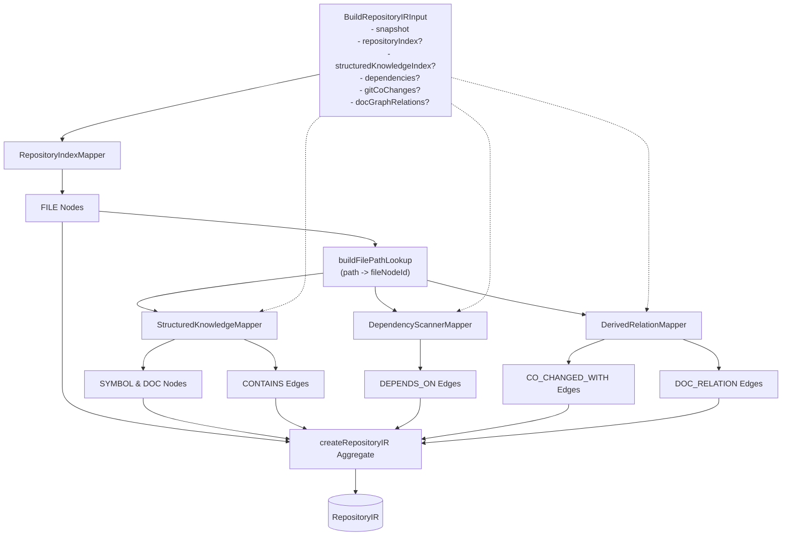

# CodePrep Phase 7C: Existing Producers → Repository IR Mapping Specification

**Status:** Approved  
**Date:** 2026-09-13  
**Target Revision (Baseline):** `555130b2df5b437f607f44f4be52b98d5b425d17`  
**Phase Context:** Phase 7C (Existing Producers → Repository IR Mapping / In-Memory IR Build)  

---

## 1. Mapping Principles

Phase 7C では、Phase 7B で確立した `RepositoryIR` Domain Model に対し、CodePrep が現在保有する分析成果（既存 Producer）を忠実に変換・統合する In-Memory Mapper 群および UseCase を提供する。

### 3大原則
1. **既存 Producer を壊さない (Preserve Existing Producers)**:
   - `RepositoryIndex`, `StructuredKnowledgeIndex`, `DependencyScanner`, `GitCoChangeClient`, `DocGraphClient` の実装コードは一切変更しない。
   - 既存 Producer の能力の限界（例: 正規表現による依存抽出、ドキュメントに限定された共変更履歴）は、そのまま `RepositoryEvidence`（`category: 'regex-pattern'` 等）に記録し、不当に高精度の解析結果として粉飾しない。
2. **IR は再生成可能な派生データ (Reproducible Derived Data)**:
   - ワークスペースのファイルシステムおよび Git 履歴が正本であり、Repository IR は任意の時点で決定論的に再構築可能である。
   - 人間の手作業による修正や非決定的な推測データを IR に持ち込まない。
3. **Task-specific 情報を混ぜない (Strict Task-Independence)**:
   - タスク解決時の一時的射影（Candidate ranking, score, matched terms, ContextConfidence, AutoPackDecision 等）は Mapper の入力に一切含めない。
   - リポジトリの構造的事実（Facts）および構造的導出関係（Derived Relations）のみを変換対象とする。

---

## 2. RepositoryIndex Mapping (`RepositoryIndexMapper`)

### 入力と出力
- **入力:** `RepositoryIndex`, `RepositorySnapshot`
- **出力:** `readonly RepositoryNode[]` (FILE, CONFIG, TEST)

### マッピング規則
- **Node ID:** `node:<snapshotId>:file:<normalizedRelativePath>`（決定論的 URI）
- **Node Kind 解決:**
  - `entry.kind === 'config'` → `config`
  - `entry.kind === 'test'` → `test`
  - `entry.kind === 'code'` / `'document'` / `'other'` → `file`
- **Metadata 保持:**
  - `fileSize`: `entry.size`
  - `contentHash`: `entry.contentHash` (SHA-256)
  - `fileKind`: `entry.kind` (元の分類)
  - `mtimeMs`: `entry.mtimeMs`
  - `extension`: `entry.extension`
- **重複排除:** 同一パスのエントリが複数存在する場合、初回エントリを採用し重複ノードの生成を防止。

---

## 3. StructuredKnowledge Mapping (`StructuredKnowledgeMapper`)

### 入力と出力
- **入力:** `StructuredKnowledgeIndex`, `RepositorySnapshot`, `knownFileNodeIds: ReadonlySet<string>`
- **出力:** `nodes: readonly RepositoryNode[]`, `edges: readonly RepositoryEdge[]`

### マッピング規則
1. **`CodeSymbolEntry` → `SYMBOL` Node + `CONTAINS` Edge**:
   - Node ID: `node:<snapshotId>:sym:<path>#<symbolKind>:<symbolName>:<startLine>`
   - Node Name: `containerName ? `${containerName}.${symbolName}` : symbolName`
   - Node Location: `{ startLine, endLine }`
   - Node Metadata: `{ symbolKind, containerName, signature, hasDocComment }`
   - Edge: `FileNode -(CONTAINS)-> SymbolNode`
   - Edge Evidence: `category: 'deterministic-ast'`, `analyzer: 'typescript-symbol-extractor'`, `confidence: 1.0`
2. **`MarkdownSectionEntry` → `DOC_SECTION` Node + `CONTAINS` Edge**:
   - Node ID: `node:<snapshotId>:doc:<path>#L<startLine>`
   - Node Name: `headingText || 'root-section'`
   - Node Metadata: `{ headingLevel, headingPath }`
   - Edge: `FileNode -(CONTAINS)-> DocSectionNode`
   - Edge Evidence: `category: 'deterministic-ast'`, `analyzer: 'markdown-section-extractor'`, `confidence: 1.0`
3. **Orphan Handling (孤児の排除)**:
   - 対応する `FileNode` が `knownFileNodeIds` に存在しないシンボルやセクションは、エッジおよびノードの生成をスキップし、不整合グラフの発生を防止。

---

## 4. Dependency Mapping (`DependencyScannerMapper`)

### 入力と出力
- **入力:** `readonly FileDependencyPair[]`, `RepositorySnapshot`, `fileNodeIdByPath: ReadonlyMap<string, string>`
- **出力:** `readonly RepositoryEdge[]`

### マッピング規則
- **Relation Type:** `depends-on` (`isDerived: false`)
- **Node 解決:** `fromPath` および `toPath` の双方が `fileNodeIdByPath` に存在する場合のみエッジを生成。
- **Unresolved ターゲットの扱い:**
  - 存在しないターゲットファイルに対して、推測で Node を自動捏造（Fabricate）しない。
  - 解決不能な import パスはエッジ生成をスキップする。
- **Evidence:**
  - `category: 'regex-pattern'`
  - `analyzer: 'dependency-scanner'`
  - `confidence: 0.8` (静的 import 正規表現マッチであり、完全な型推論・モジュールリゾルバではない実態を正確に反映)

---

## 5. Derived Relation Mapping (`DerivedRelationMapper`)

### 5.1 GitCoChange (`co-changed-with`)
- **入力:** `readonly GitCoChangeRelation[]` (共有コミット回数付き)
- **Relation Type:** `co-changed-with` (`isDerived: true`)
- **Evidence:** `category: 'git-history'`, `analyzer: 'git-cochange'`
- **Confidence:** `Math.min(Math.max(count / 10, 0.1), 1.0)` (共有コミット数に比例した統計的確信度)

### 5.2 DocGraph (`doc-relation`)
- **入力:** `readonly DocGraphRelationPair[]`
- **Relation Type:** `doc-relation` (`isDerived: true`)
- **Evidence:** `category: 'rule-derived'`, `analyzer: 'docgraph'`
- **Confidence:** ツールから渡された `rel.confidence` をそのまま維持。

### 5.3 Directory Proximity の除外判断 (Architectural Decision)
- **判断:** `DirectoryProximityClient` が算出するパス近傍度スコアは、Repository IR の Edge としては **格納しない**。
- **理由:**
  - ディレクトリ構造に基づく近傍度（共通親ディレクトリ深さ）は、ファイルパスから自明に計算可能な「クエリ時ヒューリスティック」であり、静的リポジトリの構造的エッジとして永続化する価値が低い。
  - 全ファイルペア間のディレクトリ距離をエッジ化すると、$O(N^2)$ のエッジ爆発を引き起こすため、Task Projection / Query Policy レイヤでオンデマンド計算すべき関心事である。

---

## 6. CandidateEvidence Boundary

`CandidateEvidence` に含まれる各種エビデンスのうち、IR に取り込むものと排除するものの境界を厳格に定義する。

| CandidateEvidence Kind | 取り扱い | 理由 |
|---|---|---|
| `dependency` | 取り込む (`DEPENDS_ON` Edge) | ファイル間の普遍的なモジュール依存事実 |
| `relatedTest` | 将来取り込み検討 (`TESTS` Edge) | ファイル名規則ベースのテスト関係 |
| `gitCoChange` | 取り込む (`CO_CHANGED_WITH` Edge) | コミット履歴に基づく客観的相関 |
| `markdownLink` | 将来取り込み (`REFERENCES` Edge) | ドキュメント内リンク事実 |
| `symbolSupport` | **排除 (NOT IR)** | タスク検索語とシンボル名の一致（タスク依存） |
| `manualPin` | **排除 (NOT IR)** | ユーザーの手動指定ピン（タスク依存） |
| `score` / `matchedTerms` | **排除 (NOT IR)** | タスクランキング用の一時的スコア |

---

## 7. SemanticIndex Decision

- **判断:** `SemanticIndex` の埋め込みベクトル配列（Float32Array 等）は、`RepositoryNode` の metadata には **直接埋め込まない（Phase 7C では DEFER）**。
- **理由:**
  1. **メモリ効率:** 数万ノードのリポジトリにおいて、各ノードに 768〜1536 次元の浮動小数点ベクトルを持たせると、拡張機能ホストのメモリ（V8 ヒープ）を数十〜数百 MB 圧迫する。
  2. **関心事の分離:** 構造化グラフ（Nodes & Edges）とベクトルインデックス（ANN Search）はアクセスパターンが異なり、前者はグラフ走査、後者は類似度検索に最適化された独立ストアを持つべきである。
  3. **モデル更新耐性:** Embedding モデルを変更・再インデックスした際に、Repository IR のグラフ構造全体を再構築する必要をなくすため。

---

## 8. Node ID & Provenance Strategy

### Node ID Strategy
```
node:<snapshotId>:file:<normalizedPath>
node:<snapshotId>:sym:<normalizedPath>#<kind>:<name>:<line>
node:<snapshotId>:doc:<normalizedPath>#L<startLine>
```
- すべて前方一致・階層パースが容易なコロン区切り URI。
- Windows のバックスラッシュ（`\`）はすべてスラッシュ（`/`）へ正規化。

### Provenance Strategy
- すべての Edge に `RepositoryEvidence` を付与。
- `category` と `analyzer` を明示し、「誰が、どのような解析手法で抽出・導出したか」を保持。

---

## 9. Initial Build Flow (`BuildRepositoryIRUseCase`)



- **Pure UseCase:** `BuildRepositoryIRUseCase` はファイル I/O、プロセスコール、Git CLI 実行を一切行わない。渡されたメモリ内データを統合・検証する純粋なオーケストレータである。

---

## 10. Refresh & Git Snapshot Future Design

将来の増分更新（Incremental Refresh）に向けた設計整合性：
- `RepositoryIndexChangeSet`（`added`, `modified`, `deleted`）を受け取り、影響を受けるノードおよびエッジのみを局所更新するフローへの拡張余地を確保。
- `sourcePath` と `snapshotId` がすべてのノード・エッジのエビデンスに記録されているため、「変更されたファイルパスに紐づくノードとエッジを削除し、再マッピングしたものを差し替える」という局所更新が可能。

---

## 11. Deferred Items

1. **永続化ストア (SQLite / On-disk Cache)**: Phase 7C ではインメモリ集約のみを提供。
2. **Semantic Index との直接連携**: 外部ストア参照方式を次フェーズ以降で検討。
3. **ChangeSet によるインクリメンタル更新 UseCase**: `RefreshRepositoryIRUseCase` として別フェーズで実装。
4. **細粒度テスト関係 (`TESTS`) のマッピング**: AST ベースのテストブロック解析と合わせて実装。

---

## 12. Phase 7D Input: Missing Structural Analyses Priority

Phase 7C によって、既存能力のすべてが IR に統合された。次期 Phase 7D で取り組むべき構造解析の優先順位と推奨アプローチを提案する。

| 優先度 | 構造関係 | 想定手法 (How to produce) | 目的・価値 |
|---|---|---|---|
| **P1** | `CALLS` (関数・メソッド呼び出し) | TypeScript AST (Compiler API) または LSP | 関数呼び出しチェーンの追跡（最重要） |
| **P2** | `IMPLEMENTS` / `EXTENDS` | TypeScript AST | Ports と Adapters の静的対応付け |
| **P3** | `BINDS_TO` / `INJECTS` | Framework Analyzer (手動Composition解析) | DI コンテナにおける動的ディスパッチ解決 |
| **P4** | `REFERENCES` (シンボル参照) | LSP / AST | シンボルの利用箇所の網羅的追跡 |
| **P5** | `TESTS` (テスト対応) | AST (describe / it の被テスト対象推論) | テストスイートと実装の直接リンク |
| **P6** | `USES_CONFIG` | Config AST Parser (JSON/YAML) | tsconfig や package.json 設定との連動 |
| **P7** | `READS` / `WRITES` | AST Call Analysis | 静的アセット・リソースの入出力追跡 |
