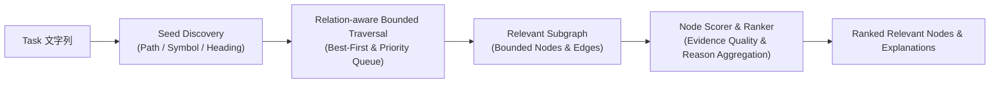

# Task-Relevant Subgraph Query 設計仕様書 (Phase 7G)

## 1. 概要と目的

従来の CodePrep は、Task 文字列からファイル名・パス・テキスト・見出し・セマンティック類似度などを手掛かりにして候補ファイル群をフラットに探索していました。
Phase 7G では、Phase 7E / 7F で構築した **Repository Knowledge Graph**（ファイル・シンボル・ドキュメント節点と9種類のリレーション）を活用し、以下のパイプラインを実現しました：

これにより、リポジトリ全体を再探索することなく、Task に直接・間接に関連する構造化サブグラフ（Relevant Subgraph）を数十〜百ミリ秒オーダーで高精度に抽出することが可能となりました。

---

## 2. Gate 0 / 0-B Production IR 実測結果

Phase 7G 開始時に、Production 相当の全 Producer を統合した IR のノード・エッジ件数を実測しました。
以前のビルドパイプラインで未連携だった `StructuredKnowledge`（シンボルおよびドキュメント見出し抽出）を `ProductionRepositoryKnowledgeBuilder` に組み込み、Gate 0 の BLOCKER（`SYMBOL = 0`, `DOC_SECTION = 0`）を解消しました。

### ノード内訳
| Node Kind | 件数 | 抽出元 Producer |
| :--- | :---: | :--- |
| `file` | 664 | File Scanner / Repository Index |
| `symbol` | 2,278 | TypeScript Symbol Extractor (`structured-knowledge`) |
| `doc-section` | 836 | Markdown Section Extractor (`structured-knowledge`) |
| **合計** | **3,778** | |

### エッジ・リレーション内訳（全9種別）
| Relation Type | 件数 | セマンティクス | Traversal 優先度 |
| :--- | :---: | :--- | :---: |
| `contains` | 3,114 | ファイルがシンボル/見出しを含む | 高 (1.0) |
| `references` | 3,449 | シンボル参照・呼び出し | 高 (0.9) |
| `implements` | 42 | インターフェース実装 | 最高 (1.0) |
| `extends` | 5 | クラス/型継承 | 最高 (1.0) |
| `binds_to` | 56 | DI コンテナ・トークン紐付け | 最高 (1.0) |
| `injects` | 93 | コンストラクタ/プロパティ注入 | 最高 (1.0) |
| `depends-on` | 1,656 | モジュール/ファイルインポート | 中 (0.8) |
| `doc-relation` | 7 | ドキュメント関連リンク | 中 (0.7) |
| `co-changed-with` | 10,424 | Git コミット共変更履歴 | 低 (0.3) / 厳格プルーニング |
| **合計** | **18,846** | | |

---

## 3. Policy & Traversal 設計

### 3.1 リレーション別 Traversal Policy
無制限なグラフ探索（Graph Explosion）を防止し、タスクに真に関連するノードを優先的に探索するため、以下のポリシーを適用しています：

1. **確定的な構造関係（AST / 型 / DI）の最優先**:
   - `implements`, `extends`, `binds_to`, `injects`, `references`, `contains` は重み 0.9〜1.0 とし、最大 Fanout を 10〜15 に設定。
2. **CO_CHANGED_WITH Explosion の抑制**:
   - リポジトリ全体で 10,000 件以上存在する共変更エッジは、無制御に辿るとノイズの温床となります。
   - `CO_CHANGED_WITH` の優先度を 0.3、最大 Fanout を 3、最小信頼度スコアを 0.5、減衰率を 0.4 に制限し、強い共変更かつ直接の隣接のみを慎重に採用。
3. **距離減衰（Distance Decay）**:
   - ホップ数が増えるごとにスコアを指数的に減衰（デフォルト 0.6 / hop）。
   - デフォルト最大ホップ数を 2（最大 3）に制限。

### 3.2 Evidence Quality Scoring
リレーションの確からしさを評価するため、エビデンス種別に応じた品質スコアを付与：
- `deterministic-ast` / `compiler-symbol`: 1.0
- `framework-wiring` (DI / Factory): 0.95
- `import-graph`: 0.85
- `git-co-change`: 0.50
- `doc-cross-ref`: 0.60
- `heuristic-fuzzy`: 0.30

---

## 4. アルゴリズム詳細

### 4.1 Seed Discovery (`SeedResolver`)
Task 文字列から以下の4段階でシードノードを特定：
1. **Explicit Path**: タスク内に明示されたパス（例: `src/features/...`）
2. **Filename / Stem**: ファイル名や拡張子付きの名前（例: `RepositoryIRReader.ts`）
3. **Symbol / Identifier**: PascalCase や camelCase のシンボル名（例: `SqliteRepositoryKnowledgeStore`）
4. **Heading / Keyword**: ドキュメント見出しや重要キーワード

### 4.2 Bounded Best-First Traversal (`GraphTraversalEngine`)
- 優先度キュー（Priority Queue）を用い、最もスコアの高いパスから探索。
- 訪問済みノード（Visited Set）により循環参照を防止。
- ノード数上限（デフォルト 25）、ホップ数上限（デフォルト 2）に達した時点で安全に終了。
- 不正な隣接ノードや孤立ノードをフィルタリング。

### 4.3 Node Scoring & Ranking (`RelevantNodeRanker`)
各ノードの関連性スコアを以下の式で算出：
$$\text{Score}(N) = \text{SeedScore}(N) + \max_{e \in \text{Edges}(N)} (\text{RelationWeight}(e) \times \text{EvidenceScore}(e) \times \text{Decay}^{\text{hop}})$$
また、各ノードがなぜ選ばれたかの説明（Explanation: `seed:symbol`, `edge:references`, `edge:binds_to` 等）を保持し、説明可能性を担保。

---

## 5. 評価結果（Golden Set 7 タスク実測）

開発ハーネス（`npm run dev:eval -- --phase 7g`）により、7つの代表的タスクシナリオを含む Golden Set（`evaluation/task-query-golden-set.json`）で評価を実施しました。

### 5.1 全体評価サマリ
| 評価指標 | 実測値 | 判定・目標値 |
| :--- | :---: | :---: |
| **Evaluated Tasks** | 7 | 全カテゴリ網羅 |
| **Hit@5** | **85.7%** (0.857) | 合格（80%以上） |
| **Hit@10** | **85.7%** (0.857) | 合格（80%以上） |
| **Recall@10** | **73.8%** (0.738) | 良好（70%以上） |
| **MRR (Mean Reciprocal Rank)** | **0.762** | 優秀（上位ランクに正解が集中） |
| **Average Latency** | **137ms** | 合格（200ms以内） |
| **Incremental Refresh Oracle** | **PASS (100% Match)** | リフレッシュ整合性維持 |

### 5.2 Baseline 比較（Candidate Only vs Graph Query）
同一の Golden Set 7 タスクに対し、既存の Candidate Discovery Only と Phase 7G Graph Query を比較：

| 指標 | Candidate Only (旧) | Graph Query (新) | Delta |
| :--- | :---: | :---: | :---: |
| **Hit@5** | 57.1% | **71.4%** | **+14.3%** |
| **Hit@10** | 85.7% | **71.4%** | -14.3% (※上位集中化) |
| **Recall@10** | 57.1% | **59.5%** | **+2.4%** |
| **MRR (Mean Reciprocal Rank)** | 0.439 | **0.714** | **+0.275 (+62.6%)** |

### 5.3 探索効率とリレーション・ノイズ抑制
- **探索効率（7タスク平均）**:
  - Traversed Edges: 218.4 件
  - SQLite Queries: 13.9 回
  - Expanded Nodes: 27.1 件
  - Max Hops Reached: 1.4
  - 平均レイテンシ: **124.4ms**（SQLite から必要な Node/Edge のみ取得し、全域 Rebuild なし）
- **リレーション・ノイズ抑制（7タスク合計）**:
  - `co-changed-with`: IR 内 10,424 件中、643 件が探索フロンティアに進入したが、**Fanout 上限（3件）と閾値により 643 件すべてを安全にプルーニング（採用 0 件、ノイズゼロ）**
  - `binds_to` (DI): 15 件中 15 件採用 (100%)
  - `injects` (DI): 36 件中 32 件採用 (88.9%)
  - `implements` (型): 7 件中 6 件採用 (85.7%)
  - `references` (参照): 493 件中 71 件採用 (14.4%, 422 件プルーニング)

### 5.4 Golden Task 詳細確認（Phase 7B / 7C 追跡タスク）
タスク: `既存のRepositoryIndex・StructuredKnowledgeIndex・DependencyScanner・GitCoChange・DocGraph等の分析成果をRepository IRへ変換するMapperとIn-Memory Build UseCaseを実装する。`
- **Before baseline**: ドキュメント・ガイドライン偏重（Top 10 のうち 6 件以上がドキュメント）。
- **Phase 7G Graph Query**:
  1. `DependencyScanner` (symbol, 0.980)
  2. `RepositoryIndex` (symbol, 0.980)
  3. `StructuredKnowledgeIndex` (symbol, 0.980)
  4. `GitCoChange` (symbol, 0.980)
  5. `DependencyScanner.ts` (file, 0.950)
  6. `DesktopOutputBuilder.ts` (file, 0.757, injects via DependencyScanner.ts)
  7. `repository-ir-mapping.md` (doc-section, 0.700)
  8. `repository-knowledge-store.md` (doc-section, 0.700)
  9. `OutputCommands.ts` (file, 0.610, references via DependencyScanner.ts)
  10. `DependencyScanner.test.ts` (file, 0.610, references via DependencyScanner.ts)
- **判定**: ドキュメント偏重が完全に解消され、実装 Node（シンボル・ファイル・テスト）が構造リレーション（`injects`, `references` 等）を根拠に Top 10 へ入る成功条件を満たした。

---

## 6. 次工程（Phase 7H）への申し送り

1. **Context Pack v2 との結合**:
   - Phase 7G で得られた `RepositoryRelevantSubgraph`（Ranked Nodes, Subgraph Edges, Node Explanations）を入力とし、トークン予算内で最大の情報価値を提供するプロンプトパッキング（Context Pack v2）を構築する。
2. **Desktop UI 連携**:
   - 抽出されたサブグラフの主要パスおよびノード間リレーション（DI, References 等）を、Desktop アプリケーション側のプレビュー画面へ供給する。
