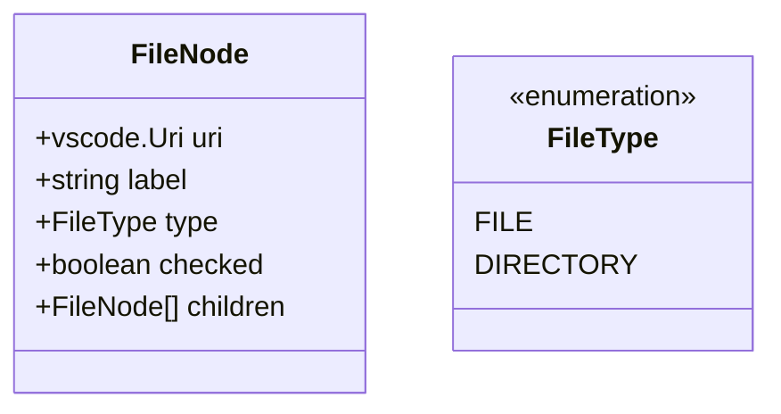

# MS_2_MODELS_UTILS Design Specification

## 1. FileNode Interface
VS Codeのツリー表示および選択状態の管理に使用するデータ構造。

- `uri`: ファイルまたはディレクトリの絶対パス。
- `label`: ツリーに表示する名前（ファイル名）。
- `type`: 'file' または 'directory'。
- `checked`: チェックボックスの選択状態。
- `children`: ディレクトリの場合の子ノード。

## 2. Path Utilities
ワークスペースからの相対パスを安全に扱うためのユーティリティ。

- `getRelativePath(workspaceRoot: string, targetPath: string): string`
    - 絶対パスをワークスペースルートからの相対パス（スラッシュ区切り固定）に変換。
- `getAbsolutePath(workspaceRoot: string, relativePath: string): string`
    - 相対パスを絶対パスに変換。